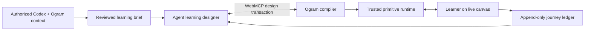

# Ogram Learning Canvas

> Every learner’s Codex agent gets a generative learning canvas. The agent authors the experience; Ogram compiles, runs, remembers, and governs it.

This repository is a working local-first prototype for the [OpenAI WebMCP Challenge](https://openai.com/webmcp-challenge/). It demonstrates a more radical learning product than a fixed lesson catalogue: a Codex-like agent can compose a complete interactive learning experience on demand from a reviewed learner brief.

The generated result is not arbitrary HTML or React code. It is a versioned `LearningExperienceDocument`: objectives, content, learning mechanisms, nodes, branches, feedback, transfer, media references, and provenance. Ogram validates that document against a trusted primitive registry and executable pedagogy policy, then renders it in the live page.

## The simple explanation

Think of Ogram as a safe box of intelligent learning Lego:

1. Codex can understand what the learner is trying to accomplish from authorized Codex context plus Ogram’s business and journey context.
2. The learner reviews the context hypotheses that may be used.
3. Codex combines Ogram’s trusted learning pieces into a bespoke mini web app.
4. Ogram checks the result: Is the goal observable? Must the learner actively think? Is there feedback? Is every branch safe and accessible? Was personalization approved?
5. The learner approves the exact compiled revision and completes the interactions.
6. Ogram records what was proposed, approved, experienced, and changed as separate immutable events.
7. Codex can later propose a new reviewed revision from feedback or learning evidence.

Adding a new lesson no longer requires adding a recipe or a React screen. If the existing primitives can express it, the agent can author it through WebMCP.

## Why WebMCP is essential

WebMCP is the live command/query connection between the agent and the visible website. It is not the renderer, the agent, or the database.

The page exposes 11 structured site tools. Codex can inspect the canvas contract, read reviewed context, propose learning needs, create and patch full experience documents, run the compiler, request learner review, publish an approved revision, register governed media references, read privacy-minimized session evidence, and propose adaptations.

This matches OpenAI’s current description of site tools: the agent operates the same live page and signed-in session as the learner. Browser API details stay isolated in [`src/lib/webmcp.ts`](src/lib/webmcp.ts) because the WebMCP proposal and host implementations are still evolving. See the current [official OpenAI site-tools documentation](https://learn.chatgpt.com/docs/webmcp).

WebMCP does **not** give the agent permission to impersonate the learner. There are deliberately no tools to:

- accept a context claim;
- approve an experience revision;
- answer a prediction, exercise, reflection, or transfer prompt;
- submit learner feedback;
- certify later real-world proof.

## Working vertical slice

The prototype includes:

- open-ended, provenance-bearing context claims with visible accept/reject controls;
- a versioned learning brief bound to an exact context snapshot;
- a declarative experience graph with bounded conditions and no executable strings;
- nine trusted primitives: objective, prediction, concept, worked example, choice, accessible sort, reflection, transfer commitment, and governed media explainer;
- a compiler with structural, pedagogical, privacy, security, capability, accessibility, asset, reachability, cycle, evidence, and completion checks;
- hard errors, warnings, recommendations, repair guidance, and a stable document digest;
- draft → patch → validate → learner review → approval → publish → run → adapt lifecycle;
- a deterministic event-reduced runtime with conditional branches and bounded remediation paths;
- learner-owned answers, confidence judgments, explanatory feedback, reflection, and real-work transfer cues;
- exact-revision consent receipts, immutable published revisions, an append-only audit/learning ledger, idempotent command receipts, and an ordered local outbox;
- metadata-only image/audio/video registration with HTTPS or `ogram-asset://` handles and required accessibility alternatives;
- three structurally different generated experiences used as test and demo fixtures;
- a responsive research-atelier interface exposing the context broker, live canvas, compiler, primitive manifest, and ledger at the same time;
- a “Compose another experience” demonstration that invokes the same WebMCP tool definitions as an agent, rather than bypassing the protocol.

## Architecture



The critical boundary is:

> Codex authors a declarative learning application; Ogram compiles, runs, remembers, and governs it.

The comprehensive architecture and rollout plan is in [`docs/universal-generative-learning-canvas-plan.md`](docs/universal-generative-learning-canvas-plan.md). The implemented system view is in [`docs/architecture.md`](docs/architecture.md).

## WebMCP tools

| Tool | Role |
| --- | --- |
| `ogram_get_canvas_contract` | Returns schema versions, primitives, policies, limits, human-only actions, and authoring workflow. |
| `ogram_get_learning_context` | Returns the reviewed learning brief, claims, provenance, and consent boundary. |
| `ogram_propose_learning_needs` | Adds hypotheses for visible learner review; never approves them. |
| `ogram_create_experience_draft` | Opens a transaction with a complete agent-authored experience document. |
| `ogram_patch_experience_draft` | Applies bounded semantic operations with optimistic revision checks. |
| `ogram_validate_experience` | Runs the structural, pedagogy, privacy, accessibility, media, and flow compiler. |
| `ogram_request_learner_review` | Presents the exact valid draft for human review. |
| `ogram_publish_experience` | Publishes only when a learner consent receipt matches the exact revision and digest. |
| `ogram_register_generated_asset` | Registers governed media metadata/handles, not binary files or embed code. |
| `ogram_get_learning_session` | Returns privacy-minimized evidence and the ledger cursor, never raw free-text responses. |
| `ogram_propose_adaptation` | Creates a compiled, learner-reviewed revision without rewriting completed history. |

## Run locally

Requirements: Node.js 20+ and npm.

```bash
npm install
npm run dev
```

Open [http://localhost:5173](http://localhost:5173).

Verification:

```bash
npm run typecheck
npm run test:run
npm run build
```

## Project map

```text
src/domain/experience.ts             Versioned context, document, runtime, consent, and ledger contracts
src/domain/primitiveRegistry.ts      Trusted learning mechanisms and canvas capability contract
src/domain/compiler.ts               Structural + pedagogical + privacy + accessibility compiler
src/domain/runtime.ts                Deterministic event-driven graph runtime
src/domain/fixtures.ts               Three diverse agent-authored demonstration experiences
src/hooks/useLearningCanvas.ts       Revisioned design transaction, human gates, runtime, and ordered outbox
src/lib/webmcp.ts                    Eleven site tools and isolated browser registration adapter
src/components/LearningCanvas.tsx    Trusted React renderer for all primitive types
src/components/ContextDock.tsx       Inspectable learner context and claim review
src/components/CanvasInspector.tsx   Compiler diagnostics, primitive manifest, and ledger
contracts/                           Public experience and event envelopes
docs/                               Architecture, implementation plan, and demo material
```

## Honest prototype boundaries

This branch implements the platform foundation and a complete browser vertical slice, not the production Ogram service:

- Local storage is the prototype cache. The state already contains immutable events, command receipts, published revisions, and an ordered outbox; production should move canonical persistence and sync to authenticated Ogram APIs/IndexedDB.
- Context is explicitly synthetic. Production needs purpose-bound access receipts, tenant authorization, expiry, correction/export/deletion, and source-material selection.
- The asset broker validates metadata and handles but does not yet upload, scan, transcode, caption, or hash binary media.
- The first registry contains nine primitives. It is intentionally extensible; richer artifact builders, simulations, dialogue, spaced retrieval, voice, and video become new trusted primitives/capabilities.
- Adaptation is initiated during an active agent turn. A backend/desktop sensor is needed for proactive delayed retrieval and later work evidence.
- Arbitrary agent code, HTML, CSS, JavaScript, network calls, and browser APIs remain out of the trusted document model. A separately sandboxed micro-app primitive can be evaluated later.

## License

[MIT](LICENSE) © 2026 Ogram.
