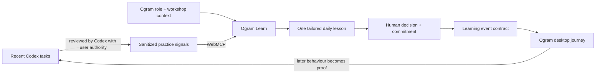

# Ogram Learn

> Ogram turns patterns from someone’s recent Codex work into one five-minute practice made for their role—and the person and their agent shape it together.

Ogram Learn is a local-first prototype for the [OpenAI WebMCP Challenge](https://openai.com/webmcp-challenge/). It exposes a structured learning workflow as site tools, renders the result in a shared human-agent lesson, and emits a narrow event contract that can continue the learning journey inside the Ogram desktop client.

The demo uses explicitly synthetic `ogram-injected-context` and synthetic behavioural observations. It never needs an OpenAI API key and never sends raw Codex conversation content.

## The product loop



The division of labour is intentional:

- **Codex reasons:** it reviews only the tasks the user authorizes and derives behavioural patterns.
- **Ogram teaches:** the app owns privacy rules, curated lesson recipes, visual ergonomics, assignments, and journey state.
- **The learner decides:** scenario answers and completion require an explicit human action.
- **The desktop closes the loop:** it can notice the next matching working moment and record proof that the habit was applied.

## Why WebMCP is essential

This is not a remote chatbot or a prompt wrapper. The agent and learner share the same signed-in, visible surface. Site-tool calls change that surface in front of the learner: a behavioural summary updates, a lesson is published, and an optional video, walkthrough, or mini-game appears. Answers and completion remain human-only page actions.

An optional Codex Visualize micro-lab could later enrich a single exercise, but it is deliberately not the core. A webpage cannot directly invoke an installed Codex skill, and making Visualize the main experience would lose Ogram’s durable journey, brand system, permissions, and judge-visible WebMCP leverage. See [the architecture decision](docs/architecture.md#why-the-canvas-is-canonical).

## Site tools

All tools are registered imperatively on the top-level page. Inputs are deliberately narrow.

| Tool | Effect |
| --- | --- |
| `ogram_get_learning_mission` | Returns the review rubric, privacy boundary, and safe tool sequence. |
| `ogram_get_injected_context` | Reads synthetic role, workshop, preference, and required-training context. |
| `ogram_get_learning_journey` | Reads the capsule, prior proofs, assignments, and sync state. |
| `ogram_submit_practice_signals` | Adds 1–4 sanitized behavioural observations to the visible evidence panel. |
| `ogram_publish_daily_capsule` | Selects a focus; Ogram combines it with injected context and a page-owned lesson recipe. |
| `ogram_add_learning_module` | Adds a validated YouTube link, short walkthrough, or Ogram-owned mini-game template—never executable page code. |
| `ogram_queue_desktop_follow_up` | Emits the practice contract through the shared desktop event envelope. |

The browser-test registry at `window.__OGRAM_WEBMCP_TOOLS__` exists only in development and tests. The real challenge path uses `document.modelContext.registerTool()`.

## Web primitives first

The experience is an interactive lesson document, not an LMS dashboard. It deliberately uses the web platform before reaching for an abstraction:

- semantic `article`, `section`, `nav`, `figure`, `fieldset`, `legend`, and `label` elements;
- native radio buttons, checkboxes, `details`, `summary`, and `progress`;
- an inline SVG concept instrument whose state is driven by CSS `:has()`;
- external links for videos rather than arbitrary embeds;
- a single top-level imperative WebMCP adapter;
- React only for lesson state, persistence, and safe component selection.

This takes inspiration from [The Way of Code](https://www.thewayofcode.com/): generous editorial space, a quiet numbered rail, and ideas learned by manipulating the page itself. The governing principles are recorded in [docs/design-principles.md](docs/design-principles.md).

## Run locally

Requirements: Node.js 20+ and npm.

```bash
npm install
npm run dev
```

Open [http://localhost:5173](http://localhost:5173).

Useful checks:

```bash
npm run typecheck
npm run test:run
npm run build
```

## Test with Codex and WebMCP

1. Open the local URL in ChatGPT’s built-in browser beside a Codex task.
2. Use GPT-5.6 Sol or Terra; current OpenAI documentation says Luna has site tools disabled.
3. Ask: **“Review my recent Codex work and use this page’s tools to build the one practice I need today.”**
4. Inspect the available site tools and, after the run, the browser’s recently used tools/sources.

The ChatGPT browser currently supports top-level imperative registration, not declarative form tools or tools inside iframes. Chrome testing requires WebMCP to be enabled through its experimental testing flag or origin trial. See the current [OpenAI site-tools guide](https://learn.chatgpt.com/docs/webmcp) and [Chrome WebMCP guide](https://developer.chrome.com/docs/ai/webmcp).

## Privacy boundary

The page never asks for task history. Codex uses its own authorized task-reading capabilities and sends only an enum, count, confidence, short behavioural summary, and recommendation.

Disallowed tool inputs include raw prompts, outputs, task titles, source files, file paths, people, companies, client names, and conversation transcripts. The mock context is visibly labelled `synthetic`. Production should add a user preview/accept/reject step before persistence, HttpOnly authenticated sessions, tenant authorization, CSRF protection, and retention controls.

## Desktop integration

The current Ogram desktop application discovered during this build is Electron/Svelte rather than Swift. The integration remains transport-neutral:

- the web app emits [`contracts/learning-event.schema.json`](contracts/learning-event.schema.json);
- an Electron preload bridge may provide `window.ogramDesktop.learning.publishEvent(envelope)`;
- otherwise the app posts to `${VITE_OGRAM_MANAGEMENT_URL}/v1/learning/events` with the existing authenticated session;
- local prototype mode queues the event and displays the expected state;
- the deep-link target uses `app.ogram://learn/capsule/<id>`; production should append only a short-lived, one-use handoff code.

Ogram’s existing background session shipper and feedback/eject pipeline should remain the sensor. WebMCP must not read the local filesystem or become a cross-app event bus. Full detail is in [docs/architecture.md](docs/architecture.md).

## Project map

```text
src/domain/lessonEngine.ts       Curated learning recipes and focus selection
src/hooks/useLearningStore.ts    Versioned journey state and human actions
src/lib/webmcp.ts                Seven site-tool schemas, validation, and registration
src/lib/desktopBridge.ts         Shared event envelope and desktop/API transport
src/components/                  Human-facing learning canvas
contracts/                       Public desktop/backend integration contract
docs/                            Architecture, challenge preflight, and demo script
```

## Submission readiness

- [x] Working local app and production build
- [x] Non-trivial imperative WebMCP tool sequence
- [x] Public-repository-ready MIT license
- [x] Mock data and judgeable no-auth path
- [x] Under-three-minute demo script
- [ ] Deploy a live judge-accessible URL
- [x] Publish the repository
- [ ] Record and publish the public YouTube demo
- [ ] Add final Devpost description, screenshots, and testing instructions
- [ ] Freeze the submitted deployment/repository during judging

The deadline shown by OpenAI is **September 3, 2026 at 1:00 p.m. PT**—**10:00 p.m. CEST in Zurich**. Always re-check the [official Devpost challenge page](https://webmcp.devpost.com/) and [official rules](https://webmcp.devpost.com/rules); those sources prevail.

## License

[MIT](LICENSE) © 2026 Ogram.
