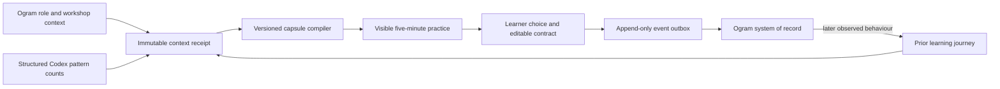

# Ogram Learn

> Declared context in. Bounded practice out. Durable proof forward.

Ogram Learn turns patterns from authorized Codex work into one short practice for the learner’s role. The agent can gather and structure context, WebMCP can build the current capsule on the live page, and Ogram can record the resulting learning journey. The learner keeps the two decisions that matter: what they would do and what practice contract they are willing to carry into work.

This repository is a public, no-auth demonstration. Its Ogram profile, Codex observations, and prior journey are visibly synthetic. It does not require an OpenAI API key, and the practice-signal contract has no field for raw Codex conversations or free-text evidence.

## The Learning Ledger



The page makes this pipeline inspectable:

- **Gather context:** one receipt records the three inputs, their provenance IDs, versions, timestamps, and synthetic or production environment.
- **Compile practice:** a deterministic Ogram recipe combines the receipt with a bounded focus, difficulty, practice mode, and proof mode.
- **Record proof:** every mutation advances one stable v3 learning session, emits an ordered event, and reports whether that event is synced, queued, or needs attention.

The browser is the interaction surface and a recoverable cache/outbox. In production, the authenticated Ogram backend is the system of record.

## Context without conversation leakage

Codex reviews only tasks the learner authorized, using capabilities outside the page. The write boundary accepts one to four observations with exactly these fields:

```text
id · level · confidence · occurrences · sampleSize
```

`id` and `level` are enums; counts are integers from 1–8; confidence is bounded from 0–1. There is no free-text evidence field. Ogram derives the visible evidence and recommendation from those counts using page-owned language.

When a capsule is published, its immutable context receipt contains only:

- learner-authorized Ogram role, workshop, preference, and assigned-training context;
- sanitized behavioural signals derived from the structured review;
- the existing learning-journey projection;
- opaque provenance IDs, source versions, capture times, and environment labels.

Raw prompts, responses, task titles, source files, paths, credentials, and names or organizations found in reviewed tasks are outside the signal contract. Learner identity and organization can appear only as separately authorized Ogram profile context.

## Six top-level WebMCP tools

The tools are registered on the top-level page with the current promise-based WebMCP imperative API and abort cleanly across React lifecycle changes. The interface reports a tool as live only after its registration promise resolves. TypeBox schemas are the single source for runtime validation and TypeScript input types.

| Tool | Contract |
| --- | --- |
| `ogram_get_learning_mission` | Returns the review rubric, privacy boundary, safe sequence, and bounded signal IDs. |
| `ogram_get_injected_context` | Reads the current Ogram context and context-receipt ID. |
| `ogram_get_learning_journey` | Reads the active capsule, prior proof, assignment, receipt, revision, and delivery state. |
| `ogram_submit_practice_signals` | Commits only structured counts and waits until the resulting revision is visible. |
| `ogram_publish_daily_capsule` | Compiles one capsule from a committed focus and bounded compiler options. |
| `ogram_add_learning_module` | Selects one Ogram-owned walkthrough or mini-game template; it accepts no teaching copy or URL. |

All mutations return an event ID and committed revision. Tool success means the page state is committed and verifiable, not merely that a callback was requested. Answers, contract edits, capsule completion, and reminder consent are intentionally absent from the tool list; they remain visible learner actions.

The development/test registry at `window.__OGRAM_WEBMCP_TOOLS__` supports deterministic browser tests. The real path uses `document.modelContext.registerTool()`.

## A bounded capsule compiler

Codex selects; Ogram compiles. The agent cannot write the core lesson, inject markup, or improvise executable UI.

The compiler combines a context receipt with:

- one focus: `thread_hygiene`, `workspace_hygiene`, `effort_fit`, or `task_shaping`;
- `guided` or `stretch` difficulty;
- `decision` or `rehearsal` practice;
- `next_action` or `observed_habit` proof.

Every capsule records its recipe ID, recipe version, receipt ID, and selected modes. The output is deterministic for the same inputs apart from capsule identity and creation time. Optional modules are selected only by Ogram-owned template ID; WebMCP never accepts module prose, URLs, HTML, CSS, JavaScript, iframe markup, screenshots, or recordings.

## The learner’s authority

The lesson follows three movements:

1. **Notice** the pattern, rule, provenance, and a focus-specific visual explanation.
2. **Choose** an action and compare its consequence.
3. **Apply** by editing a cue → response → proof contract and optionally requesting a reminder.

Only the learner can choose, edit, and complete. Completion adds the practice to the Learning Ledger; it does not pretend that transfer has already happened. A later observed or confirmed behaviour can become proof.

## Journey recording

State version 3 gives the learning run one stable session ID and a monotonic revision. Each mutation creates an append-only event envelope containing its event ID, idempotency key, session ID, revision, actor, timestamp, optional capsule ID, and privacy-minimized data.

The transport always enqueues first, then flushes in order:

1. use `window.ogramDesktop.learning.publishEvent()` when a narrow native preload bridge exists;
2. otherwise post to `${VITE_OGRAM_MANAGEMENT_URL}/v1/learning/events` with the existing authenticated browser session;
3. otherwise retain the event in the local outbox and display it honestly as queued.

Every envelope is validated against the public JSON Schema before it can enter or leave the outbox. Recent event receipts plus a per-session delivered-revision cursor prevent acknowledged history from being re-enqueued after receipt pruning. A failed event stays at the head of the queue so later events cannot overtake it. Local storage is useful for refresh recovery; it is not the production record of truth.

See [the architecture](docs/architecture.md) and [the public event contract](contracts/README.md) for the full boundary.

## Run locally

Requirements: Node.js 20+ and npm.

```bash
npm install
npm run dev
```

Open [http://localhost:5173](http://localhost:5173).

Run the verification suite with:

```bash
npm run typecheck
npm run test:run
npm run build
```

## Test the WebMCP path

1. Open the page in a browser/host with WebMCP site tools enabled.
2. Inspect the six available Ogram tools.
3. Ask the agent: **“Review the Codex work I authorize and use this page’s tools to build the one practice I need today.”**
4. Verify the source receipt before the lesson, then make the scenario choice and edit the practice contract yourself.
5. Inspect the recently used tools and the page’s journey-delivery status.

For a browser-only demonstration, choose **Run the live build**. That control calls the same tool definitions with synthetic structured counts; it does not bypass the WebMCP action layer.

Current host constraints and setup instructions belong to the official [OpenAI site-tools guide](https://learn.chatgpt.com/docs/webmcp) and [Chrome WebMCP documentation](https://developer.chrome.com/docs/ai/webmcp).

## Web primitives first

The experience is a learning document, not an LMS dashboard. It uses semantic regions, native forms, `details`, `progress`, accessible labels, focus-specific inline SVG figures, restrained CSS motion, and normal external links. React owns state consistency and safe component selection. Self-hosted fonts avoid a third-party font request.

The technology choices are deliberately small:

- React + TypeScript + Vite for the visible application;
- TypeBox for one runtime/type-level schema definition;
- the native, promise-based WebMCP registration API with abortable lifecycle cleanup;
- native browser storage for the recoverable v3 cache and delivery outbox;
- an Ajv-generated standalone validator for the public event contract at the transport boundary;
- Vitest and Testing Library for domain, adapter, transport, registration, and interaction tests.

## Project map

```text
src/domain/contextEngine.ts       Immutable context receipts and provenance validation
src/domain/signalEngine.ts        Structured counts → page-owned learning signals
src/domain/lessonEngine.ts        Deterministic, versioned capsule recipes
src/domain/learningSession.ts     Pure, revisioned learning-state transitions
src/hooks/useLearningStore.ts     React commit receipts, persistence, and outbox effects
src/lib/webmcpSchemas.ts          TypeBox input contracts
src/lib/webmcp.ts                 Six tool definitions and committed-state responses
src/lib/journeyTransport.ts       Ordered idempotent outbox and delivery channels
src/generated/                    Build-generated standalone event validator
src/components/                  Learning Ledger, receipt, lesson, and WebMCP bridge
contracts/                       Public backend/desktop event boundary
docs/                            Architecture, design principles, and demo script
```

## Production boundary

The public demo deliberately stops before identity, tenancy, and real Codex/Ogram data. Production still requires authenticated server context, learner preview/accept/reject controls, tenant authorization, CSRF protection, retention and deletion controls, secure desktop IPC, and a backend uniqueness constraint for idempotency. The synthetic path must remain available for public review without exposing proprietary Ogram systems or customer data.

## License

[MIT](LICENSE) © 2026 Ogram.
