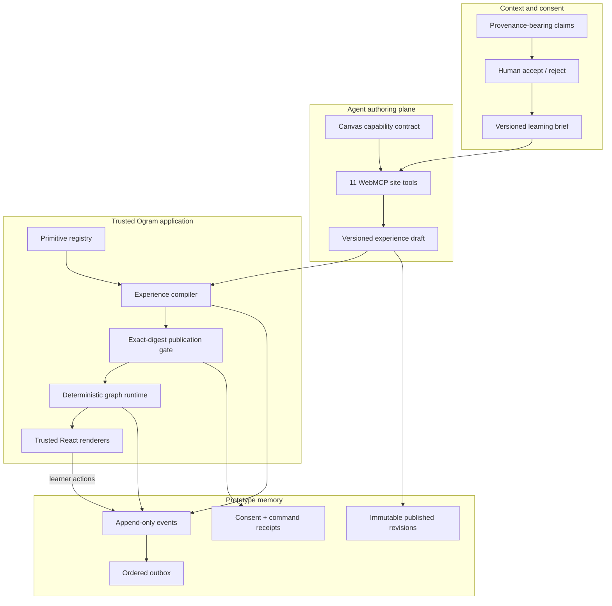
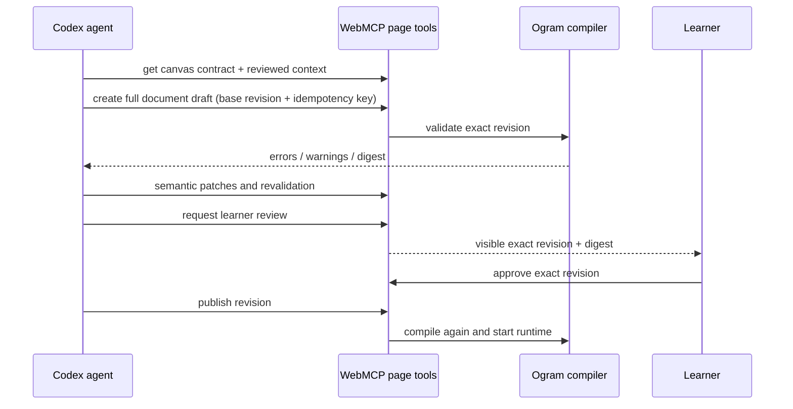

# Implemented architecture — universal generative learning canvas

## Product boundary

The refactor replaces four hard-coded topic recipes with a general learning-application intermediate representation:

> Codex authors a declarative learning application; Ogram compiles, runs, remembers, and governs it.

Codex owns the subject, objective, content, sequence, graph, interaction pattern, feedback, transfer design, and media references. Ogram owns the accepted language, schemas, primitive implementations, pedagogy/privacy/accessibility policies, runtime, consent, revision history, and journey ledger.

## Implemented local system



## Context and consent broker

Context enters as a `ContextClaim`, not a transcript and not one of four fixed enums. Each claim records:

- kind and short summary;
- learner, Codex, Ogram profile/pixel, or journey source;
- optional confidence;
- sensitivity and allowed purposes;
- opaque evidence references, observation time, and optional expiry;
- pending, accepted, corrected, or rejected review state.

Only accepted/corrected claim IDs can appear in the personalization provenance of a compiled experience. The WebMCP tool may propose a hypothesis but cannot accept it. The UI creates that learner event.

## Experience document

`LearningExperienceDocument` is the agent-authored application:

```text
schema + registry + policy versions
context snapshot + learning brief bindings
metadata + observable objectives
typed primitive nodes + bounded conditional edges
completion + adaptation policies
governed assets + four-lane provenance
```

The document accepts no HTML, JSX, CSS, JavaScript, executable expression, `eval`, browser API, or direct network call. Conditions use a tiny AST: `always`, `answer_equals`, or `response_correct`. V1 graphs are acyclic; remediation uses explicit forward retry nodes.

## Trusted primitive registry

The initial `ogram.learning.v1` catalogue contains nine mechanisms:

1. `orient.objective`
2. `diagnose.prediction`
3. `explain.concept`
4. `model.worked_example`
5. `practice.choice`
6. `practice.sort`
7. `consolidate.reflection`
8. `transfer.commitment`
9. `media.explainer`

Each registry entry declares its mechanism, evidence tier, supported learning roles, emitted events, accessibility contract, complexity cost, requirements, forbidden uses, and research provenance. React components receive only the current node, registered assets, learner response, and allowed runtime callbacks.

## Compiler

The compiler runs before review and again immediately before publication. Its hard errors currently cover:

- unsupported schema, policy, primitive, or primitive version;
- missing or non-observable objectives;
- duplicate/missing references and unsupported learning roles;
- unreachable nodes, missing exits, broken conditions, or cycles;
- passive-only experiences and objectives without learner-generated evidence;
- passive completion, no unassisted attempt, or missing required transfer;
- choices without correct answers or explanatory feedback;
- invalid sort categories and missing corrective feedback;
- personalization based on unapproved claims;
- executable/unsafe content;
- unsafe asset URLs, missing alt text/transcripts, or unknown media handles.

Warnings preserve agent judgment for missing prediction/self-explanation, excessive duration, or disproportionate interaction complexity. Every result contains rule IDs, paths, explanations, suggested repairs, research references, and a stable digest.

## Design transaction over WebMCP



Every modifying tool carries an idempotency key and the relevant base revision. Stale writes fail. The agent-facing publish tool fails without an exact learner consent receipt. The local “Compose another experience” demo executes the same tool definitions as the native WebMCP route.

## Runtime and learning evidence

The runtime is derived from the immutable published document plus learner events. Primitive components cannot mutate the document, storage, WebMCP, or network directly.

Current state is:

```text
active node + visited nodes + response map + status
```

Branch conditions inspect only the response produced by their source node. The runtime distinguishes response correctness, confidence, and assistance. Completion requires configured learner-generated nodes, a minimum number of unassisted attempts, and transfer when requested. It explicitly does not claim mastery or delayed transfer.

Raw reflection/commitment text remains in local runtime state for immediate experience feedback. Ledger events record only node ID, response kind, correctness, confidence, and counts. `ogram_get_learning_session` never returns raw free-text responses.

## Ledger and revisions

The prototype state contains:

- append-only sequenced events with actor, revision, idempotency key, and summary;
- immutable published document revisions;
- context and publication consent receipts;
- idempotent command receipts;
- an ordered outbox of event IDs;
- the current local cache and runtime projection.

Local storage is a cache/vertical-slice persistence adapter. Production should move canonical records to an authenticated Ogram service, use IndexedDB for richer offline queues, and deliver the ordered outbox with retry/backoff and server acknowledgements.

## Media and future modalities

WebMCP does not carry generated binary media. The agent registers image/audio/video metadata plus an HTTPS or `ogram-asset://` handle, digest, attribution, alt text, and transcript. The compiler resolves a `media.explainer` node only when accessibility and handle checks pass.

Production asset work still required:

- signed upload/import intents;
- malware and content scanning;
- hashing, deduplication, and tenant ownership;
- image variants, audio/video transcode, captions, and transcript review;
- retention and deletion receipts.

Voice interaction, video generation, artifact builders, simulations, guided dialogue, and spaced retrieval should enter as new versioned capabilities/primitives—not arbitrary agent code in the trusted page.

## Security boundary before production

- HttpOnly, Secure, SameSite sessions plus CSRF protection.
- Tenant authorization on every context, asset, revision, event, and receipt.
- Purpose-bound access, expiry, correction, export, retention, and deletion.
- CSP with exact origins; no arbitrary embeds or renderer network access.
- Server-side schema/policy compilation and digest verification.
- Asset scanning and opaque signed handles.
- Unique idempotency constraints and strict optimistic concurrency.
- Immutable audit storage and privacy-minimized journey projections.
- Electron main-process authentication with a narrow preload bridge if desktop integration is added.

## Production adapters intentionally not simulated

The browser vertical slice does not pretend to include authenticated Ogram context services, the canonical backend event store, binary media processing, background delivery, proactive desktop sensors, delayed retrieval scheduling, or cross-device sync. The corresponding domain seams and contracts are present; those services remain the next implementation phases described in [`universal-generative-learning-canvas-plan.md`](universal-generative-learning-canvas-plan.md).
