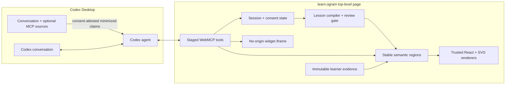
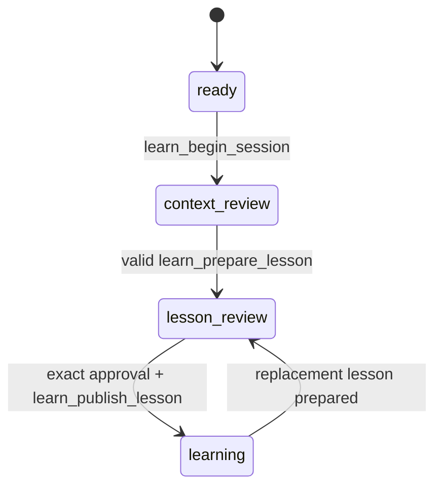

# Architecture — learn.ogram v3

## Product boundary

The Codex Desktop conversation is the sole conversational surface. learn.ogram is the live page beside it: a top-level WebMCP owner, a governed learning state machine, and a semantic notebook renderer.



The page never receives raw connector content or credentials. The agent is responsible for external research and connector access, then passes only minimized learner claims or bounded citation records through page tools.

## State model

`AgentLearningCanvasState` is the persisted v3 projection:

```text
version + canvas revision
learning session (topic, stage, consent, personalization)
reviewable context claims
lesson draft, compiler result, approval, and publication revision
ordered stable canvas regions
focus + selected text
privacy-minimized event ledger
bounded idempotency receipts
```

The session stages are:



Only the v3 storage key is loaded. A reload restores session, claims, draft/publication status, regions, evidence, history, and the correct registration stage, but never restores an in-memory nonce. Codex must call `learn_begin_session` again to resume and unlock the tools.

## Dynamic WebMCP registration

All tools are registered imperatively by the top-level document. Generated iframes own no tools.

| State | Native tools registered |
|---|---|
| No active nonce / ready | `learn_begin_session` |
| Context review | bootstrap, session/context reads, context proposal, snapshot, lesson preparation |
| Lesson review | context-review set plus publication |
| Published learning | all eleven v3 tools |

Each registration group has its own `AbortController`. A stage transition aborts the prior group before registering the next one. The fallback registry exposes all definitions for test/replay environments while every handler independently enforces nonce and state gates.

## Context consent

Context has two distinct gates:

1. Before Codex consults conversation history or a connector, the learner explicitly authorizes a scope and provider set. `learn_propose_context` carries that attestation.
2. The page renders each minimized claim with route, provider, resource type, sensitivity, purpose, and opaque evidence reference. The learner accepts, corrects, or rejects it.

An agent cannot mark a claim approved. A claim cannot personalize a lesson until card-level review is complete. Choosing the generic path rejects any still-pending claims and records `personalization: skipped`.

## Authoring and publication

`learn_prepare_lesson` replaces the old multi-call draft workflow. It accepts a complete region document or the bundled technical-beginner transformer template, validates it, and places a valid result in learner review.

The v3 validator checks:

- an observable objective and meaningful title;
- four to twelve unique, non-empty stable regions;
- at least one learner-owned interaction;
- personalization claims against the accepted claim set;
- a focused prototype duration warning;
- preservation of any published region that already contains learner evidence.

The learner approves the exact compiled revision. `learn_publish_lesson` requires that exact revision, the latest canvas revision, a nonce, and an idempotency key. Publishing preserves existing learner responses on matching regions and rejects structural drafts that would remove or alter completed interactions.

## Semantic canvas regions

Each `CanvasRegion` has a stable ID, order, label, objective, kind, monotonic revision, status, trusted content, optional learner interaction/response, provenance, and bounded undo history.

The semantic snapshot includes:

- canvas and region revisions;
- region purpose, content, status, attribution, and response-completion state;
- the focused region and selected text;
- visible region IDs plus current viewport dimensions and scroll position;
- the trusted renderer registry and widget budgets.

`learn_patch_region` can replace, append, annotate, or set an activity status. Its input has no learner-response or interaction field, so it cannot cross the ownership boundary. A content write creates a prior-state snapshot and an undo token. A background-research `agent_working` transition is coalesced with the completed result so undo restores the usable pre-research region rather than a stranded working state.

If an `agent_working` region receives no completion within ninety seconds, local housekeeping returns it to `ready`, records a timeout event, and preserves its prior content. The rest of the notebook remains usable throughout.

## Trusted renderers

V3 ships native, responsive renderers for:

- editorial prose and emphasized explanations;
- concise key-point grids;
- token sequences;
- accessible SVG attention weights;
- transformer-block stacks;
- comparisons;
- research synthesis and source cards.

The transformer fixture uses six stable regions: goal, tokens/embeddings, self-attention, transformer block, next-token practice, and teach-back. The choice and reflection controls create immutable learner evidence.

## Sandboxed widgets

`learn_inject_widget` accepts HTML, CSS, JavaScript, title, accessible summary, and fixed height. The page enforces 12 KB HTML, 12 KB CSS, 24 KB JavaScript, and a 180–720 px height.

The iframe is created with:

```html
<iframe sandbox="allow-scripts" ... />
```

Its `srcdoc` CSP sets `default-src 'none'`, allows inline styles/scripts required by the payload, allows only data images, and blocks connections, media, fonts, objects, nested frames, form actions, and base URLs. Omitting `allow-same-origin`, forms, top navigation, popups, downloads, and modals prevents access to the parent origin and browser capabilities.

The wrapper validates `postMessage` by source window, channel, widget ID, event type, and numeric resize bounds. A two-second ready timeout removes the iframe and retains the previous region content with an accessible text fallback. External reset/stop controls and an Escape message return keyboard control to the parent.

This is a rendering sandbox, not a source of WebMCP tools or network access.

## Events and idempotency

The local ledger records session start, context proposal/review/skip, lesson preparation/approval/publication, region patch, widget injection, research attachment, reversion, and learner evidence submission. Payloads use IDs, counts, revisions, digests, and bounded summaries rather than raw connector content or long learner answers.

Every agent write checks its idempotency receipt before its expected revision. An exact retry therefore returns its original result even after the state advances. A new command with a stale canvas or region revision fails and tells the agent which read tool to call before retrying.

## Responsive and accessibility contract

The desktop layout assumes a right-hand Codex browser pane: a narrow sticky concept map, generous notebook measure, and a subtle left-edge agent bridge. At narrower widths, the map becomes a horizontal region index and all two-column review layouts stack. The page has no horizontal page overflow; intentionally wide diagrams/tables scroll inside their own bounded containers.

Landmarks, semantic headings, native controls, focus-visible styling, text alternatives, SVG titles, live regions, keyboard Escape handling, and reduced-motion rules are part of the shipped implementation.

## Prototype boundaries

- A site cannot force an unsolicited Codex message; the bootstrap tool returns the guide Codex should relay.
- The page cannot control Codex Desktop’s split layout.
- The in-browser persistence adapter is a local prototype cache, not a multi-tenant canonical store.
- The sandbox constrains capabilities but cannot guarantee interruption of all pathological CPU-heavy JavaScript; production should add stronger process/time isolation.
- Rich future renderers can enter behind the trusted registry and dynamic imports without widening the core tool surface.
