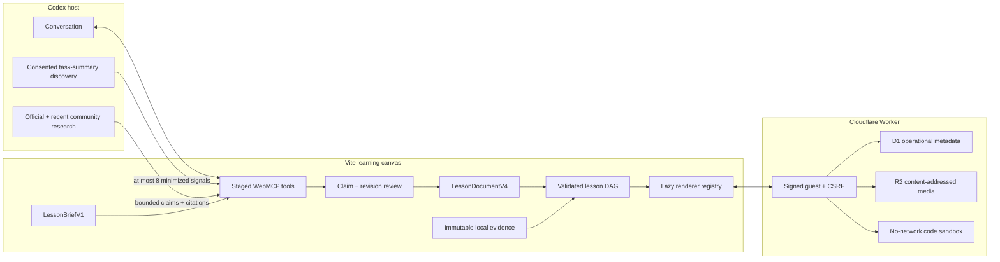

# Architecture — learn.ogram V4

## Product boundary

The Codex conversation is the coordination surface. The adjacent page owns a local-first lesson brief, reviewed learner context, a validated lesson document, a semantic canvas, and immutable learner evidence. The Cloudflare service owns only operational resources needed for governed media and isolated code execution.



Raw task prompts, transcripts, code, and task IDs never enter the lesson or backend. The site cannot read task history; the host may inspect no more than ten accessible summaries from the prior 30 days when the learner leaves personalization enabled. Unavailable history falls back to the current conversation and saved brief.

## One schema-driven authoring core

`LessonDocumentV4` contains the topic metadata inherited from V3 plus:

```ts
schemaVersion: 4
blueprintId: string
pedagogicalMode: "conceptual" | "quantitative" | "code" | "scenario" | "mixed"
sourcePolicy: "evergreen" | "current"
regions: LessonRegion[]
flow: { entryRegionId: string; edges: LessonEdgeV4[] }
assetRefs: string[]
```

The `open_topic_v1` blueprint accepts every pedagogical mode. A mode selects only an initial 3–5-region skeleton; the final 3–20-region document is supplied as data. No topic, number of sections, or subject-specific renderer is embedded in the page route.

`src/domain/lessonRegistry.ts` is the shared source for:

- authoring capabilities returned to Codex;
- supported content and exercise discriminators;
- blueprint metadata and source policy;
- renderer loading behavior;
- validation and service quotas.

That coupling makes unsupported types fail before publication and lets a future registered renderer or exercise enter without a new document version.

## Brief, context, and topic radar

The landing page stores `LessonBriefV1` at `learn-ogram-brief:v1`. It includes topic/question, desired outcome, level, minutes, preferred modes, accessibility notes, starter/blueprint, and the explicit recent-task toggle.

Context use has two human gates:

1. The learner controls which source scopes Codex may consult.
2. Each derived claim is accepted, corrected, or rejected before it can personalize the draft.

`LessonContextPackV1` is bounded to eight 280-character signals and contains no raw source material. For a `current` lesson, optional `TopicRadarSignalV1` entries carry authority, retrieval date, availability, official URL, community URLs, and three normalized scores. Overall rank is calculated as 50% learner relevance, 30% official recency, and 20% community corroboration. Product behavior requires an official reference; community-only entries remain visibly labeled exploration ideas.

## Graph validation and branching

V4 validates the lesson as a directed acyclic graph:

- 3–20 unique regions, all reachable from the entry region;
- no cycles or dangling endpoints;
- no more than three outgoing edges per region;
- no more than four conditional decisions on any path;
- a single unconditional fallback, last by priority, wherever conditional edges exist;
- no ambiguous mixture of answer and correctness conditions on one decision;
- at least one learner exercise on every terminal path;
- all asset references declared by blocks;
- required source provenance for current product claims.

At runtime, completed, current, and locked regions remain visible in the concept map while unselected branch bodies are hidden. Submitting an exercise resolves its outgoing edge. The answer, correctness/result evidence, and selected edge cannot be changed. Any structural edit therefore creates a new draft revision and returns to learner review.

## Content and exercise registries

V4 keeps all V3 blocks and adds:

| Block | Runtime policy |
|---|---|
| `formula` | KaTeX, HTML+MathML, `trust: false`, strict errors, no authored macros, 4 KB, required accessible label. |
| `diagram` | Mermaid strict mode, HTML labels and links disabled, 16 KB, required title and description. |
| `code_example` | Escaped semantic code with language, caption, and optional highlighted lines. |
| `media` | Ready governed asset reference with caption, attribution, and kind-specific accessibility data. |

Images require alt text. Audio requires a transcript. Video requires both a transcript and VTT captions. Native audio/video controls are shown, autoplay is absent, and preload is metadata-only. A malformed or unavailable rich block renders an accessible textual fallback instead of failing its region.

Exercises are `choice`, `reflection`, `numeric`, and `code_lab`. Numeric evaluation uses an authored absolute tolerance and optional unit. Code tests are registered server-side; the lesson receives only the immutable exercise ID, visible test descriptions, starter source, and fallback prompt.

KaTeX, Mermaid, CodeMirror, and language modes load through `React.lazy` only when their block is rendered. Offscreen regions use `content-visibility: auto`. The build script reads Vite’s manifest and rejects an initial JavaScript graph above 145 KB gzip.

## V3 migration and persistence

The local projection uses `learn-ogram-canvas:v4`. If it is absent, the loader reads `learn-ogram-canvas:v3`, retains content, responses, provenance, region history, session state, and revisions, and adds sequential `always` edges. It writes V4 only after the migrated document validates. The original V3 key remains untouched for rollback.

The `transformer_technical_beginner` blueprint remains a deprecated alias for one release and is exercised as a regression fixture. The older V2 key is outside the migration boundary.

## WebMCP lifecycle

The top-level document owns all imperative registrations. Generated iframes register no tools.

| State | Native registrations |
|---|---|
| Ready | start brief, authoring capabilities, begin session |
| Context review | ready tools plus session/context reads, context proposal, snapshot, prepare, asset registration, and code registration |
| Lesson review | context set plus publication |
| Learning | all 15 tools |

Every handler validates its own nonce and state gate, including the fallback registry. Agent writes are idempotent and revision checked. The learner approves the exact validated digest/revision; publication also asks the Worker to reject unresolved, failed, expired, or guest-inaccessible asset and exercise IDs.

## Worker services

Cloudflare Workers Static Assets serves the SPA and routes `/api/*` and `/media/*` through `worker/index.ts`.

D1 contains only:

- signed anonymous session metadata and the one-run concurrency flag;
- asset metadata and inactivity expiry;
- server-side code-test manifests and inactivity expiry;
- rolling run events and sandbox cold/warm activity.

R2 objects are keyed by SHA-256. Import accepts HTTPS only, strips fragments, forbids credentials and local/private literal destinations, follows at most three revalidated redirects, checks declared MIME and magic bytes, rejects HTML/SVG, and enforces per-kind plus per-lesson quotas.

The stable `@cloudflare/sandbox` runtime uses a pinned custom image. A sandbox ID is derived from guest and exercise IDs. Its work directory is replaced on each run, internet is disabled at the container class, packages and secrets are not supplied, and only JavaScript, TypeScript, or Python one-file runners are available. Commands have a five-second process limit, combined output is capped at 64 KB, one guest run may be active, and the rolling allowance is 20 runs per ten minutes. Containers sleep after ten idle minutes.

The service never persists submitted source. The browser stores source, SHA-256, bounded result summary, and submission time as learner evidence.

## HTTP and observability boundary

`GET /api/session` issues a signed, HTTP-only, secure, same-site guest cookie and returns a CSRF token. Mutations require an exact same-origin request, valid cookie, and matching CSRF header. Anonymous assets and code manifests expire after 90 inactive days; a daily scheduled handler marks expired records and removes unreferenced R2 objects.

Logs are deliberately metadata-only: normalized endpoint, response status, latency, quota outcome, and sandbox cold/warm state. Request bodies, context, answers, prompts, test contents, and code are never logged.

## Remaining release boundary

The repository can test and package the stack, but a production release still requires the owner’s legal eligibility/rules acknowledgment, Workers Paid/Containers access, provisioned staging resources, and real Sandbox smoke tests in all three languages. Those are explicit gates in `docs/challenge-preflight.md` and `docs/deployment.md`.
