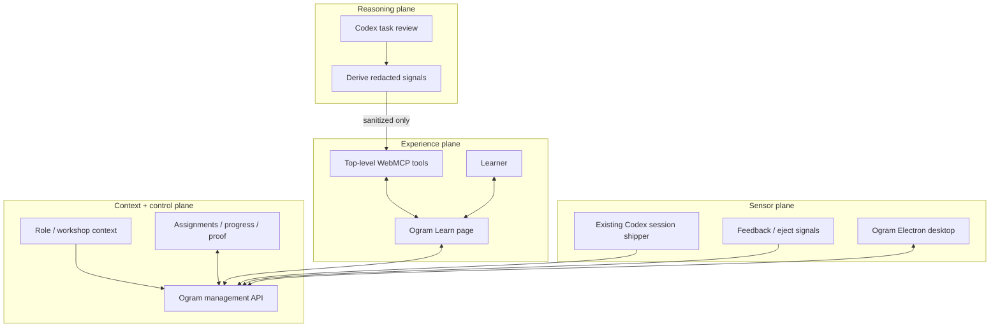

# Architecture

## Decision

The Ogram web canvas is the canonical product and system of record. Codex Visualize is an optional companion micro-lab, never the main transport or persistence layer.

The implementation follows a web-primitives-first constraint: semantic HTML, native forms and disclosures, inline SVG, CSS, one top-level imperative WebMCP adapter, and React only for state and safe component selection. See [design principles](design-principles.md).

### Why the canvas is canonical

WebMCP is designed for a human, an agent, and a live web application to share state. Ogram Learn uses that property directly:

1. Ogram exposes narrow site tools from the visible page.
2. Codex reviews only user-authorized task history through its own capabilities.
3. Codex submits privacy-minimized observations.
4. Each tool call visibly changes the shared canvas.
5. The learner answers and explicitly commits through page-only controls that are not exposed as agent tools.
6. Ogram persists the journey and lets the desktop companion look for later proof.

A tool that merely returns “please invoke Visualize” would be a prompt trampoline: it is host-dependent, loses longitudinal state, weakens WebMCP leverage, and cannot guarantee Ogram’s visual or privacy system. A future tool may return a sanitized visualization recipe; Codex still decides whether to use it.

## Four planes



## Review boundary

The page cannot and should not silently read other Codex tasks. The first tool returns a bounded mission:

- inspect at most eight authorized recent tasks from a seven-day window;
- derive only `thread_hygiene`, `workspace_hygiene`, `effort_fit`, or `task_shaping`;
- send counts, confidence, and a short sanitized behavioural summary;
- never send prompts, outputs, task titles, files, paths, people, organisations, client data, or transcripts.

In production, the learner previews each signal before persistence and can accept, reject, or correct it.

## Lesson ownership

Codex chooses the focus from a narrow enum. Ogram combines that choice with injected role and workshop context. Its recipe engine controls:

- lesson duration and cognitive load;
- concept explanation;
- answer choices and feedback;
- progress checkpoints;
- the cue → response → proof practice contract;
- visual hierarchy and accessibility.

Codex may also select one bounded learning module: a validated YouTube id, a short walkthrough, or an Ogram-owned mini-game template. The page never accepts agent-authored HTML, CSS, JavaScript, iframe markup, screenshots, or recordings. This “lesson compiler” keeps the experience flexible without turning it into an unbounded page builder.

## Capability boundary

| Idea | Prototype decision |
| --- | --- |
| Relevant YouTube video | A host with browsing may find it separately, then pass only an 11-character video id. Ogram renders a normal external link. |
| Computer Use tutorial | Host-dependent and explicitly authorized; WebMCP cannot start Computer Use. A later approved asset can become a walkthrough. |
| Record & Replay | Separate macOS capability with recording consent; never triggered silently by a page tool. |
| Visualize | Optional user-selected sidecar; the page cannot invoke the plugin. |
| Mini web-app game | Page-owned React/HTML template with deterministic content and rubric; the agent selects only a template id. |

Current ChatGPT Site tools discover top-level imperative registrations, not declarative tools or tools registered inside iframes. The challenge path therefore keeps all tools in the page’s small adapter and all learner interaction in visible native controls. See the [official OpenAI Site tools documentation](https://learn.chatgpt.com/docs/webmcp).

## Longitudinal desktop loop

The current desktop target is the Electron/Svelte Ogram client; no Swift project was found in the inspected workspace. A future Swift client can consume the same HTTPS/event contract.

The existing `ogram sessions ship --background` pipeline already provides a credible sensor. It should derive signals server-side or locally, for example:

```text
thread_hygiene.long_running_without_fork
workspace_hygiene.broad_cwd
model_fit.effort_excessive
model_fit.effort_insufficient
```

Raw working directories should become a classification (`project_git`, `project_non_git`, `home_or_broad`, `temp`, `unknown`) and, if correlation is needed, a tenant-salted project hash.

The web app emits the public [`learning-event.schema.json`](../contracts/learning-event.schema.json). Production delivery order:

1. use the authenticated Ogram management API as canonical storage;
2. expose a main-process-only `LearningClient` in the desktop app;
3. add narrow preload methods for journey read, event write, capsule open, and handoff redemption;
4. subscribe or poll for journey changes;
5. surface a just-in-time cue when the sensor observes the next matching behaviour;
6. record the observed new habit as proof.

Suggested endpoints:

```text
POST /api/learning/reviews
GET  /api/learning/context?review_id=<opaque-id>
POST /api/learning/capsules
POST /api/learning/capsules/:id/events
GET  /api/learning/journey
POST /api/learning/handoffs
```

Suggested deep link:

```text
app.ogram://learn/capsule/<capsule-id>?handoff=<one-time-code>
```

The handoff code should be opaque, single-use, and expire within 60 seconds. No bearer token, PII, lesson content, or task identifier belongs in the URL. The prototype link omits the handoff code and demonstrates routing only.

## Security requirements before production

- HttpOnly, Secure, SameSite web sessions with CSRF protection on mutations.
- Exact-origin CORS and tenant authorization on every read/write.
- Main-process authentication; never return management tokens to the renderer.
- Electron `contextIsolation: true`, `nodeIntegration: false`, `sandbox: true`, a restrictive CSP, navigation/window denial, and sender-origin validation.
- Exact allowlists for external URLs and deep-link hosts, paths, and actions.
- Fail closed if encrypted credential storage is unavailable.
- Replace long-lived WebSocket bearer query parameters with 30–60 second one-use tickets.
- Append-only learning events plus idempotency uniqueness.
- User-controlled data review, retention, and deletion.

## Prototype-to-production phases

1. **Challenge prototype:** public WebMCP app, synthetic context, browser persistence, public event schema, and mock desktop status.
2. **Redacted Ogram signals:** authenticated context endpoint, Lake-derived behaviour summaries, consent preview, and canonical learning journey.
3. **Desktop companion:** typed preload bridge, one-time-code deep links, push/poll updates, and proof-of-application cues.

This keeps proprietary desktop code and customer data out of the public judging path while demonstrating a real, credible integration.
