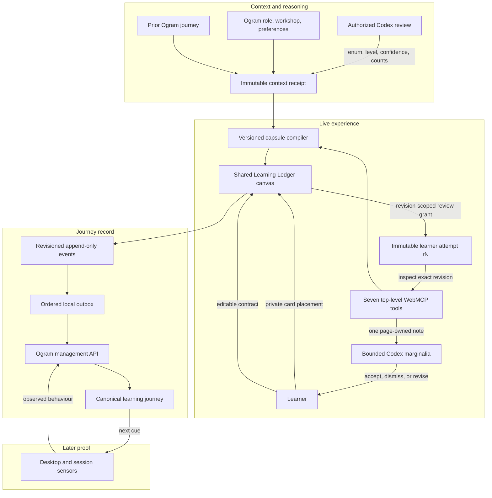
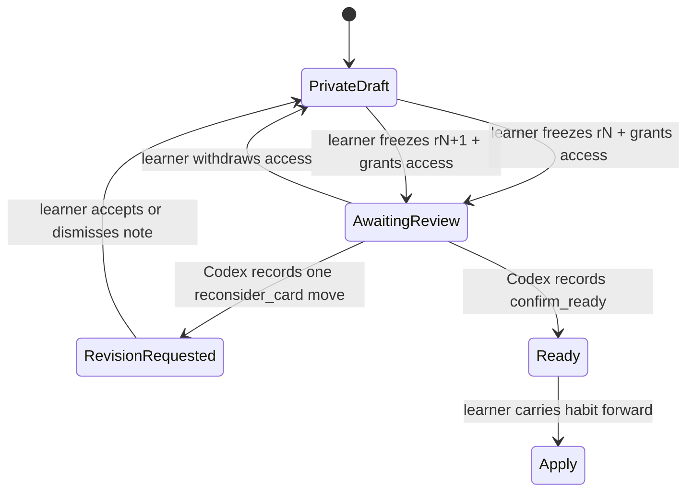

# Architecture

## Decision

Ogram Learn separates three responsibilities that the earlier prototype blurred:

1. **The page is the canonical shared instrument.** It exposes tools, shows context provenance, renders the capsule, freezes learner-authorized attempts, and keeps every human and agent turn visible.
2. **Ogram owns the learning compiler.** Codex selects from bounded inputs; it does not author lesson copy, pedagogy, or executable UI.
3. **The authenticated Ogram backend is the production system of record.** Browser persistence is a recoverable cache and ordered delivery outbox, never proof that a server write happened.

This boundary preserves WebMCP’s useful property—a person, agent, and live application repeatedly working on the same visible state—without making the page an authority on private Codex history or the agent an editor of learner-owned work. A chat response can explain a habit, but only the WebMCP path can inspect an explicitly shared page revision and attach a verified note to that exact live object.

## System shape



## 1. Context injection becomes a receipt

The compiler never consumes an informal pile of context. It receives one `ContextReceipt` with three named sources:

| Source | Permitted content | Provenance |
| --- | --- | --- |
| `ogram_context` | Role goals, workshop notes, preferences, assigned training | Opaque ID, version, capture time, environment |
| `codex_practice_signals` | Sanitized signal enum, level, confidence, task count, page-owned evidence/recommendation | Opaque ID, version, capture time, environment |
| `ogram_learning_journey` | Prior capsule title/focus/status and bounded proof projection | Opaque ID, version, capture time, environment |

Receipt assembly validates all enums and bounds, rejects unexpected signal fields and duplicate IDs, deep-clones the accepted values, then deep-freezes the result. All three sources must agree on `synthetic` or `production`. The receipt carries its own opaque ID, schema version, and assembly timestamp.

This is an audit object, not a data lake. No field exists for a Codex prompt, response, task title, file content, path, credential, or transcript. Names and organizations discovered in reviewed tasks cannot cross the signal boundary; the learner name and organization may appear only in the separately authorized Ogram profile source.

### Authorized Codex review boundary

The mission asks Codex to inspect no more than eight learner-authorized tasks from a seven-day window through Codex’s own task-reading capabilities. The page never reads those tasks.

The signal write accepts one to four records containing only:

```ts
{
  id: "thread_hygiene" | "workspace_hygiene" | "effort_fit" | "task_shaping";
  level: "watch" | "practice" | "priority";
  confidence: number;  // 0–1
  occurrences: number; // integer, 1–8
  sampleSize: number;  // integer, 1–8
}
```

The page verifies that counts are possible and compiles them into Ogram-authored evidence and recommendations. Free-text behavioural evidence does not cross WebMCP.

The public demo constructs a receipt from visibly synthetic fixtures. A signal submission is a candidate input, not a receipt: publication assembles the immutable receipt and capsule in one transition, so the visible capsule can never point at a different snapshot. Production must add a learner preview that can accept, reject, or correct each derived observation before persistence.

## 2. WebMCP is an action protocol

Seven imperative tools are registered on the top-level document:

```text
ogram_get_learning_mission
ogram_get_injected_context
ogram_get_learning_journey
ogram_submit_practice_signals
ogram_publish_daily_capsule
ogram_inspect_practice_attempt
ogram_record_coaching_move
```

TypeBox definitions provide both JSON Schema and inferred TypeScript types. Every object rejects additional properties; enums, lengths, counts, and arrays are bounded. Context, journey, and the learner-shared attempt are annotated as containing untrusted content. Mutation tools return a structured receipt with an event ID and revision.

The React bridge calls the promise-based imperative API directly so it can expose truthful registration progress and failure, and aborts registrations during Strict Mode cleanup. One shared feature-detection boundary handles late API availability. A development-only registry exposes the same definitions to deterministic tests.

### Committed-state rule

A successful write cannot mean “React state was requested.” Each action returns its target revision. The tool waits until that revision is observable, verifies the resulting state where appropriate, and only then resolves. This makes the result inspectable by the human and by a subsequent read tool.

Agent writes are also safe under normal host retries. When signal submission, capsule publication, or coaching receives an identical already-committed request, the adapter returns the original durable `eventId` and revision with `replayed: true` rather than advancing state again. A retry that conflicts with the coaching move already attached to an attempt revision fails closed.

The agent can read context, submit structured observations, compile a capsule, inspect one explicitly shared practice revision, and attach one bounded note. It cannot add arbitrary learning modules, move a card, inspect private draft movements, supply coaching prose, resolve its own note, edit the practice contract, complete the capsule, or request a reminder. Those are page-only learner actions.

### Repeated co-manipulation protocol

The flagship `thread_hygiene` capsule turns the page into a shared context-packing workbench. Eight structural cards move between `carry` and `leave`; their labels, descriptions, correct rubric, and coaching language are owned by Ogram.



Each share creates an immutable snapshot with a monotonic `attemptRevision`. The read tool can inspect only the latest exact revision while consent is `granted`. It returns the eight card IDs, labels, descriptions, current zones, three coarse rubric indicators, and privacy exclusions. It does not return the expected zones, raw source content, or unshared edits.

The write tool accepts only one of two shapes: `reconsider_card` with an allowlisted card ID, or `confirm_ready` with no card. The page rejects stale revisions, a second review on the same revision, a note aimed at a correctly placed card, and a premature ready claim. Ogram compiles the visible marginalia from page-owned copy; the tool accepts no message field. A successful coaching move consumes the grant and reports `agentMovedCards: 0`.

Consent is fail-closed. Sharing opens one review cycle scoped to one frozen revision. The learner can withdraw it before coaching; the cycle is consumed by its single coaching move and is reset to private when cached state is restored. A new `r2` therefore requires a new visible learner grant. The comparison and turn trace preserve both sides of the exchange without turning private movements into telemetry.

## 3. Capsule creation is compilation

The lesson engine is a deterministic, versioned compiler, not a page generator. Its intermediate representation is intentionally small:

```text
focus        thread_hygiene | workspace_hygiene | effort_fit | task_shaping
difficulty   guided | stretch
practice     decision | rehearsal
proof        next_action | observed_habit
receipt      opaque context-receipt ID
```

Ogram owns four recipe families. A recipe controls the concept, objective, principle, scenario, choices, feedback, default cue → response → proof contract, duration, and coach note. Compiler metadata travels with every capsule:

```text
recipeId · recipeVersion · contextReceiptId · difficulty · practiceMode · proofMode
```

The same bounded input and context produces the same pedagogical content; only generated identity and time vary. `stretch` can increase duration and challenge; `rehearsal` changes how the decision is framed; `observed_habit` asks for downstream behavioural evidence.

The internal renderer can still represent Ogram-owned supplementary modules:

- an Ogram-owned `clean_handoff` or `effort_triage` walkthrough;
- an Ogram-owned `context_packing` or `reasoning_match` mini-game.

They are not part of the challenge-facing WebMCP surface. The context-packing workbench is the core `thread_hygiene` practice rather than an agent-selected mini-game. No public tool accepts teaching prose, URLs, HTML, CSS, JavaScript, iframe markup, arbitrary component trees, screenshots, or recordings.

## 4. The learner closes the semantic gap

The capsule has three stages:

1. **Notice:** inspect the rule, focused visual explanation, evidence, and full context receipt.
2. **Practice:** use a focus-appropriate live instrument. For thread hygiene this is the compose → share → inspect → coach → revise → re-share loop; other focus recipes retain a native consequence choice.
3. **Apply:** edit the cue, response, and observable proof; explicitly choose whether a future reminder is wanted.

Attempt sharing, choice, review resolution, contract editing, and completion remain learner-owned actions. Coaching is Codex-attributed, but its copy and legal state transitions are page-owned. A context-packing capsule cannot advance to Apply until an exact shared revision is confirmed ready. Completion means the contract was committed, not that the habit was learned. The Learning Ledger represents proof separately as awaiting, observed, or confirmed so later server/desktop evidence can advance the journey without rewriting history.

## 5. Stable session and revision model

The cached application state is version 4. One learning run has one stable `sessionId`; every mutation increments a monotonic state `revision`. Shared practice snapshots also carry their own monotonic `attemptRevision` (`r1`, `r2`, and so on). Each event stores the state revision, along with a unique ID, time, actor, summary, type, and bounded payload.

The revision gives three systems a shared concurrency marker:

- the UI knows which state it renders;
- WebMCP can wait for and report an exact commit;
- the event envelope records the state transition it represents.

The separate attempt revision lets the page reject coaching aimed at a stale learner artifact even when unrelated state revisions have advanced.

Browser state survives a refresh to support the demo and recover interrupted delivery. Active inspection permission does not: restore changes any cached `granted` consent back to `private` and returns the collaboration to drafting. In production, the server journey should hydrate the page and reconcile any pending client events.

## 6. Append-only journey transport

Every local event is transformed into the public [`learning-event.schema.json`](../contracts/learning-event.schema.json) envelope and enqueued before delivery. The event ID is also the idempotency key. The outbox stores attempt metadata and a bounded list of delivered event IDs.

The collaboration loop emits four distinct, actor-explicit events:

- learner shared an attempt and granted that revision’s review cycle;
- learner withdrew consent before coaching;
- Codex recorded one bounded coaching move and consumed the cycle;
- learner accepted or dismissed the coaching note.

Their public names are `learning.practice_attempt.shared`, `learning.practice_consent.withdrawn`, `learning.practice_coaching.recorded`, and `learning.practice_review.resolved`. None carries card placements or private draft movements.

Delivery selection is deterministic:

1. **Native IPC:** call the narrow `window.ogramDesktop.learning.publishEvent(envelope)` preload method when present.
2. **Management API:** otherwise send an authenticated `POST` to `${VITE_OGRAM_MANAGEMENT_URL}/v1/learning/events`.
3. **Local queue:** if neither channel exists, keep the event pending and say so in the interface.

The queue validates each envelope against the public schema, then flushes serially. A failure leaves the event pending at the head of the queue; later events do not overtake it. An acknowledgement removes the item and advances a per-session delivered-revision cursor while retaining a bounded set of recent event IDs. If acknowledgement storage fails, retry is safe because the backend must enforce idempotency.

Truthful status is part of the architecture:

| UI status | Meaning |
| --- | --- |
| `queued` | Persisted in the browser outbox, not acknowledged by Ogram |
| `syncing` | An ordered flush is in progress |
| `synced` | The chosen channel acknowledged every pending event |
| `error` | Delivery or outbox persistence failed; retry is required |

The browser must never call a locally queued event “recorded by Ogram.”

## Desktop and server boundary

The desktop application is a companion and sensor, not a second event schema. A recommended preload surface is deliberately narrow:

```ts
interface OgramLearningBridge {
  publishEvent(event: LearningEventEnvelope): Promise<void>;
  openCapsule?(capsuleId: string): Promise<void>;
}
```

The main process owns authentication. The renderer does not receive management tokens. The same backend can accept web and desktop events, expose the current journey, and correlate later behavioural observations with a practice contract.

A deep link may route to `app.ogram://learn/capsule/<capsule-id>`, but production handoff data should use an opaque, single-use, short-lived code. Bearer tokens, PII, lesson content, and task identifiers do not belong in a URL.

## Security requirements before production

- Authenticate with HttpOnly, Secure, SameSite cookies and protect mutations against CSRF.
- Authorize tenant and learner ownership on every context, capsule, journey, and event operation.
- Enforce a backend uniqueness constraint for idempotency and retain events append-only.
- Revalidate the public event schema server-side; browser validation is not an authorization boundary.
- Keep exact-origin CORS and allowlists for external URLs and deep links.
- In Electron, enable context isolation and sandboxing, disable Node integration, validate sender origin, and expose only narrow preload methods.
- Let learners preview derived signals and control retention, correction, export, and deletion.
- Treat Ogram/profile/journey text returned through read tools as untrusted data, not instructions for the agent.
- Keep the public synthetic fixture isolated from production identities and data.

## Prototype-to-production path

1. **Public demonstration:** synthetic receipt, focused seven-tool action protocol, repeated `r1 → Codex note → r2` co-manipulation, deterministic compiler, v4 browser cache, ordered outbox, public event schema.
2. **Authenticated context:** server-issued source provenance, learner signal review, canonical journey hydration, tenant-safe event ingestion.
3. **Longitudinal proof:** desktop/session sensors observe bounded behaviours, Ogram records proof, and the next receipt includes the updated journey.

The architecture can therefore demonstrate the whole product logic in public without pretending that local storage is a backend or exposing proprietary Ogram systems.
