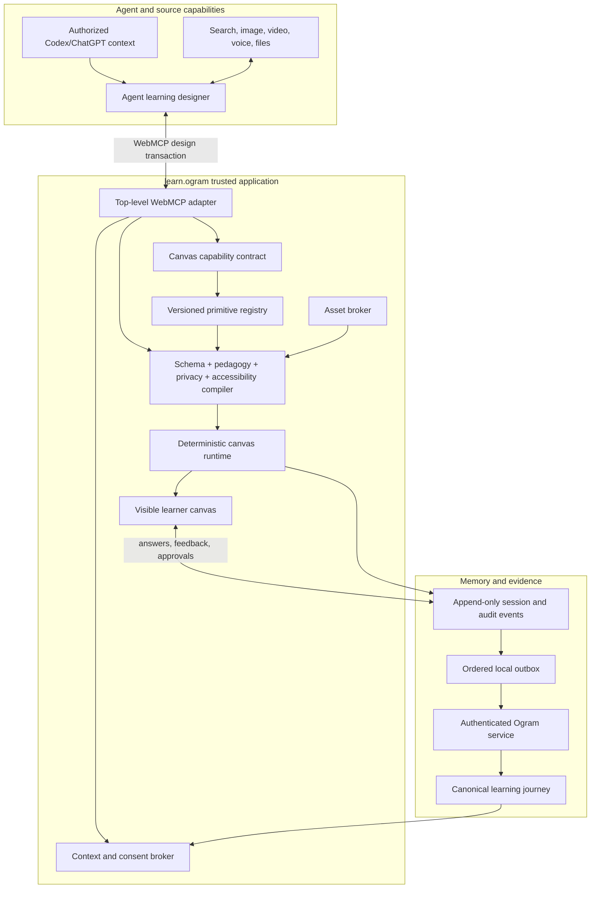

# Universal generative learning canvas — major refactor plan

**Branch:** `refactor/universal-generative-learning-canvas`
**Base:** `main` at `4c39a6b` (`snapshot/v1-practice-desk`)
**Status:** architecture plan with the first end-to-end platform vertical slice implemented
**Working product name:** Ogram Learning Canvas

## Implementation checkpoint — 29 August 2026

This branch now implements the plan's foundational browser slice rather than the old fixed-capsule product:

- versioned context claims, learner review, learning brief, experience document, graph, conditions, assets, provenance, consent, runtime, revisions, and ledger types;
- nine trusted learning primitives and generic React renderers;
- executable structural, pedagogy, privacy, security, accessibility, media, capability, reachability, completion, and complexity compiler rules;
- 11-tool WebMCP draft/validate/review/publish/adapt lifecycle with base revisions and idempotency receipts;
- exact-digest human publication approval and learner-only response/feedback actions;
- deterministic branching runtime, remediation paths, explanatory feedback, reflection, transfer, immutable events, published revisions, and an ordered outbox;
- three structurally distinct generated experience fixtures plus unit, integration, and rendered desktop/mobile tests.

The authenticated Ogram context service, canonical backend event store, IndexedDB/offline delivery, production binary asset broker, proactive desktop sensor, delayed retrieval scheduler, and richer primitive catalogue remain later phases. The local state is deliberately an honest prototype adapter for those seams.

## 1. Product decision

Ogram Learn will become a universal runtime in which a learner's Codex-like agent can author a bespoke, interactive learning application from current goals, research, work, prior knowledge, Ogram business context, and prior learning evidence.

The agent owns the learning experience's subject, objective, content, sequence, interaction pattern, branching, feedback, media, and adaptation. Ogram owns the language in which that experience is expressed, the trusted renderer, consent and privacy, accessibility, evidence-backed pedagogical constraints, revision history, and the durable learning journey.

The governing sentence is:

> Codex authors a declarative learning application; Ogram compiles, runs, remembers, and governs it.

This explicitly reverses the current architecture decision in which Codex selects one of four focus IDs and fills a scenario template. The current implementation is a useful compatibility fixture, but it is not the future product model.

### From the current prototype to the new platform

| Current prototype | Target platform |
| --- | --- |
| Four fixed `SignalId` values | Open-ended, provenance-bearing learner needs and goals |
| Four hard-coded lesson recipes | Agent-authored learning-experience documents |
| One multiple-choice capsule shape | A graph of composable learning and UI primitives |
| One-shot publication | Draft → validate → review → publish → adapt lifecycle |
| WebMCP writes a few strings | WebMCP operates a versioned design transaction |
| Whole-state `localStorage` snapshot | Append-only events, revisions, cache, and ordered outbox |
| Completion means clicking a button | Completion requires objective-linked learner evidence |
| Personalization is hidden in copy | Every context claim and design decision has provenance |

### Non-negotiable product principles

1. **Agent authorship is real.** Adding a new lesson must not require a new recipe or React screen.
2. **Ogram governs mechanisms, not lesson content.** Constraints live in schemas, primitives, policies, and runtime invariants—not a narrow topic catalogue.
3. **Personalization is negotiated.** Codex observations are hypotheses; Ogram context is purpose-bound; the learner can inspect, correct, exclude, and approve what is used.
4. **The canvas requires active learning.** Passive consumption alone cannot establish completion or mastery.
5. **Creativity is compositional.** The agent can combine content, flow, interaction, state, layout, feedback, and media without arbitrary code in the trusted application.
6. **Learning claims stay uncertain.** Completion, assisted success, unassisted performance, delayed retention, transfer, and observed work evidence are distinct.
7. **The experience can evolve without rewriting history.** Published versions and encountered learner events are immutable; adaptation creates a recorded revision.
8. **The human remains an actor.** The agent cannot approve context, answer an exercise, submit learner feedback, or certify completion on the learner's behalf.
9. **The system is inspectable.** The learner can answer: Why this lesson? What data was used? What did the agent create? Which policy shaped it? What changed later?
10. **The platform optimizes for delayed, unassisted transfer—not engagement theater.** Completion rate and time-on-page are secondary signals.

## 2. A necessary technical clarification about WebMCP

WebMCP is the live agent-facing command/query port. It is not the renderer, the agent, or the durable ledger.

- The **agent** reasons from authorized context and may orchestrate host capabilities such as task reading, search, image generation, and eventually video or voice.
- **WebMCP** exposes Ogram's current capabilities and accepts bounded design operations in the open, top-level page.
- The **Ogram compiler and runtime** validate and render the agent-authored experience.
- The **Ogram event store** is the canonical learning and audit ledger.

The WebMCP draft describes a web page exposing JavaScript functions with natural-language descriptions and structured schemas to an agent. OpenAI's current site-tools implementation lets Codex and a person use those actions in the same live page. That makes it an excellent authoring and adaptation surface, while persistence and authorization remain Ogram responsibilities.

Because WebMCP and host support are still changing, all browser API details must stay behind one adapter. Domain services must not import `document.modelContext` directly.

## 3. Target system architecture



### Architectural layers

1. **Context and consent broker** — transforms declared, observed, Ogram, and journey context into reviewable claims and an approved learning brief.
2. **Canvas contract** — advertises schema versions, primitive capabilities, pedagogy policies, limits, and supported media.
3. **Experience compiler** — turns an agent-authored document into an immutable runtime program after structural, pedagogical, privacy, accessibility, and capability checks.
4. **Primitive registry and renderer** — maps a versioned declarative vocabulary to trusted React components and typed events.
5. **Runtime** — executes bounded state, branching, scoring, hints, retries, and completion deterministically.
6. **Journey and audit ledger** — preserves what was proposed, approved, published, experienced, revised, learned, and later applied.
7. **Asset broker** — safely imports and records agent- or Ogram-generated media without placing binaries or unchecked URLs in WebMCP calls.

## 4. Context and learning-needs pipeline

The platform needs a richer boundary than either "send the transcript" or "send one of four enums." It should exchange typed, reviewable claims.

### Context sources

- **Learner-declared:** current goal, question, desired outcome, time, language, accessibility needs, and explicitly selected source materials.
- **Codex-observed:** sanitized patterns from authorized work or research, expressed as hypotheses with confidence and provenance—not copied conversations.
- **Ogram-provided:** role goals, business processes, product state, workshop context, required training, and pixel-derived business logic.
- **Journey-derived:** prior attempts, assistance used, delayed retrieval, transfer evidence, feedback, and currently open learning commitments.

### Core context claim

```ts
interface ContextClaim {
  id: string;
  kind:
    | "stated_goal"
    | "current_project"
    | "active_research"
    | "prior_knowledge"
    | "misconception"
    | "behaviour_pattern"
    | "business_constraint"
    | "preference"
    | "accessibility"
    | "journey_evidence";
  summary: string;
  source:
    | "learner"
    | "codex_observation"
    | "ogram_profile"
    | "ogram_pixel"
    | "ogram_journey";
  confidence?: number;
  sensitivity: "low" | "personal" | "restricted";
  evidenceRefs: string[];
  allowedPurposes: string[];
  observedAt: string;
  expiresAt?: string;
  review: "pending" | "accepted" | "corrected" | "rejected";
}
```

### Learning brief

Only reviewed claims enter a versioned `LearningBrief`:

- the learner's desired capability or outcome;
- why it matters now;
- current evidence and uncertainty about prior knowledge;
- likely misconceptions or friction;
- intended transfer context;
- available time and modalities;
- explicitly selected research/source material;
- prohibited uses and retention;
- approved context-claim IDs;
- the exact context and consent receipt versions.

### Consent model

Use separate receipts for separate purposes:

1. source/context access;
2. selected research material;
3. exact experience revision publication;
4. adaptive changes during a run;
5. microphone, camera, or media access;
6. later proof-of-application monitoring;
7. retention, export, correction, and deletion.

The agent can propose claims and request review; it cannot create an approval receipt. Approval binds to the exact IDs, purpose, expiry, and document digest.

### Important change from the current privacy rule

The default remains privacy-minimized, but the universal canvas cannot categorically ban all source material. A learner must be able to explicitly select a paper, excerpt, document, code sample, or other artifact as lesson material. This is a separate, visible consent mode—not an implicit side effect of asking Codex for help.

## 5. The agent-authored learning experience document

The core intermediate representation is a versioned `LearningExperienceDocument`, not generated React code and not a recipe ID.

```ts
interface LearningExperienceDocument {
  specVersion: "1.0";
  registryVersion: string;
  pedagogyPolicyVersion: string;
  experienceId: string;
  draftRevision: number;
  contextSnapshotId: string;
  learningBriefId: string;

  metadata: {
    title: string;
    locale: string;
    estimatedMinutes: number;
    rationale: string;
  };

  objectives: LearningObjective[];
  variables: VariableDefinition[];
  nodes: LearningNode[];
  edges: LearningEdge[];
  entryNodeId: string;
  completion: CompletionPolicy;
  adaptation: AdaptationPolicy;
  assets: AssetReference[];
  provenance: ProvenanceReference[];
}
```

Each node is a discriminated union tied to one primitive version:

```ts
interface LearningNode {
  id: string;
  primitiveId: string;
  primitiveVersion: string;
  learningRole:
    | "activate"
    | "explain"
    | "model"
    | "practice"
    | "retrieve"
    | "assess"
    | "reflect"
    | "transfer";
  objectiveIds: string[];
  props: PrimitiveSpecificProps;
  assetIds?: string[];
}
```

### What Codex may author

- objectives and observable success criteria;
- the subject matter and sourced claims;
- scene/node sequence and topology;
- layout composition from trusted layout primitives;
- content, examples, distractors, rubrics, and feedback;
- interaction types and bounded state;
- branches, hints, retries, and scaffold fading;
- difficulty and transfer distance;
- generated or selected media references;
- revision proposals after feedback.

### What the trusted runtime controls

- accepted schema and primitive versions;
- safe rich-text AST or restricted Markdown rendering;
- component implementations and design tokens;
- condition evaluation and bounded loops;
- event attribution and learner identity;
- accessibility semantics and fallbacks;
- asset resolution and network access;
- consent, publication, and revision gates;
- state persistence and ledger writes.

No core document field accepts HTML, JSX, arbitrary CSS, JavaScript, `eval`, arbitrary expressions, browser APIs, or raw network calls.

### Flow and conditions

Use a small condition AST rather than executable strings:

```ts
{ op: "answer_equals", nodeId: "decision-1", value: "fork" }
{ op: "score_gte", objectiveId: "objective-1", value: 0.8 }
{ op: "attempts_lt", nodeId: "recall-1", value: 3 }
{ op: "all", conditions: [/* bounded child conditions */] }
```

The compiler checks reachability, valid references, fallback paths, maximum depth, and termination. Cycles are rejected unless represented by an explicitly bounded retry primitive.

### Generative UI standards decision

A2UI 1.0 already defines agent-to-renderer JSON messages, custom component catalogs, capabilities, validation, data binding, and updates. Those ideas closely match this architecture.

Before freezing Ogram's wire format, run a short ADR spike comparing:

1. a native Ogram `LearningExperienceDocument`; and
2. A2UI with an `ogram.learning.v1` custom catalog plus a separate pedagogy/ledger envelope.

Adopt A2UI only if the same generated fixtures remain compact, WebMCP-friendly, easy to validate, and capable of expressing objective alignment, learning evidence, revision semantics, and bounded flow. At minimum, keep Ogram's catalog/version/capability design mappable to A2UI so the project does not become an unnecessary UI protocol island.

## 6. The learning-science primitive system

Ogram's innovation lives in a **pedagogically typed primitive registry** and a transparent compiler—not in predetermined lessons.

UI components and learning mechanisms remain separate. A `Card` is a visual component; `free_recall` is a learning primitive. One primitive may use several components, and the same visual component may support different learning roles.

### Initial semantic primitive catalogue

| Family | Initial primitives | Purpose |
| --- | --- | --- |
| Orient and authorize | `objective`, `relevance_frame`, `learner_choice` | Make the goal and accepted relevance visible |
| Diagnose and activate | `prediction`, `prior_knowledge_probe`, `misconception_probe`, `confidence_judgment` | Reveal knowledge and uncertainty before teaching |
| Explain and model | `micro_explanation`, `worked_example`, `contrast_case`, `multimedia_demo` | Provide concise instruction and models |
| Generate and practise | `free_recall`, `construct_response`, `self_explain`, `teach_back`, `classify_sort_sequence`, `scenario_simulation`, `guided_dialogue`, `artifact_builder` | Require retrieval, generation, manipulation, explanation, decision, or construction |
| Feedback and scaffold | `explanatory_feedback`, `hint_ladder`, `worked_example_fade`, `retry`, `revise_artifact` | Diagnose and repair after an attempt |
| Transfer and consolidate | `novel_variant`, `near_transfer`, `far_transfer`, `interleave`, `spaced_retrieval`, `reflection`, `implementation_intention`, `real_world_proof` | Test changed contexts and connect learning to later work |

### Primitive definition

```ts
interface PrimitiveDefinition {
  id: string;
  version: string;
  mechanism: string;
  evidenceTier: "replicated" | "promising" | "experimental";
  citations: ResearchReference[];
  validWhen: string[];
  boundaryConditions: string[];
  inputSchema: JsonSchema;
  supportedRoles: string[];
  emits: string[];
  accessibilityContract: AccessibilityContract;
  complexityCost: number;
  requires: string[];
  forbids: string[];
  lastReviewedAt: string;
}
```

The registry becomes the source of truth for JSON Schema, TypeScript types, React rendering, the capability manifest, documentation, pedagogy linting, accessibility tests, and runtime events.

### Executable pedagogy policy

Each policy rule returns:

```ts
{
  ruleId,
  ruleVersion,
  severity: "error" | "warning" | "recommendation",
  path,
  explanation,
  suggestedRepair,
  researchReferences
}
```

#### Hard compiler errors

- no observable objective or success criterion;
- no learner-generated action;
- an objective with no unassisted evidence opportunity;
- passive viewing as the only completion condition;
- revealing a solution before an attempt without marking the evidence assisted;
- a scorable attempt with no explanatory feedback or retry/revision path;
- multiple-choice distractors that introduce false information without corrective feedback;
- inaccessible interaction or media without a non-drag/non-audio/keyboard fallback;
- a broken branch, unreachable node, or unbounded loop;
- unsafe HTML/code/URL/media or unapproved context use;
- unsupported primitive/capability version;
- an experience without a valid exit and transfer/completion rule.

#### Contextual warnings

- prior knowledge is unknown but the experience assumes novice or expert status;
- exposition precedes a useful prediction or diagnostic without rationale;
- a novice task lacks a model or worked example;
- repeated success does not fade assistance or increase transfer distance;
- media is decorative, redundant, or unrelated to an objective;
- confidence calibration, spacing, interleaving, or later retrieval would be useful but absent;
- density, duration, or complexity budgets look disproportionate;
- personalization is based on a preference framed as a fixed "learning style."

Warnings preserve agent judgment. A warning may be overridden with a recorded rationale; a hard error may not.

### Research and policy provenance

Maintain a versioned evidence registry with four visible provenance lanes:

1. **Pedagogy:** which primitive and policy versions shaped the experience, with citations and boundary conditions.
2. **Content:** sources for factual claims, model answers, rubrics, and generated examples.
3. **Personalization:** accepted context-claim IDs and why each was used.
4. **Generation:** model/tool, schema, asset hashes, timestamps, and experience revision.

Ogram should never claim that a policy is universally optimal. Evidence tier, population, scope, caveats, review date, and overrides belong in the data model and the learner-facing "Why this experience?" view.

## 7. Canvas registry, renderer, and runtime

### Trusted primitive registration

```ts
registerPrimitive({
  id: "practice.classify",
  version: "1",
  schema,
  renderer: ClassifyPrimitive,
  supportedRoles: ["practice", "assess"],
  emits: ["attempt.submitted", "feedback.presented"],
  accessibilityContract,
  complexityCost: 2,
});
```

Every renderer receives a restricted runtime interface: read its allowed state, emit typed learner events, request an allowed transition, and resolve asset handles. It receives no direct network, storage, WebMCP, or global-state access.

Render each node behind a local error boundary with an accessible fallback so one bad node cannot destroy the entire run.

### Runtime state

Compile a valid document into an immutable `RuntimeProgram`. Derive runtime state by reducing ordered events rather than allowing components to mutate the document.

```text
loading → ready → active → checkpoint → completed
                       └──────────────→ paused / abandoned / error
```

Keep rich, short-lived session events separate from privacy-minimized, durable journey events. Raw learner responses or artifacts are not copied into the general ledger by default; store them separately only when feedback requires them, with consent and retention rules.

### Interpretable first adaptation policy

| Evidence | Default adaptation |
| --- | --- |
| Incorrect + high confidence | Contrast case → explanation → parallel retry |
| Incorrect + low confidence | Hint or worked example → completion problem |
| Correct + low confidence | Explain why → schedule retrieval for calibration |
| Correct + high confidence | Fade support → less similar transfer problem |
| Correct only with hints | Do not mark mastery; request a later unassisted variant |
| Repeated delayed success | Increase spacing and interleave a related objective |
| Learner says irrelevant/frustrating | Revisit goal, context, difficulty, or interaction—not a supposed learning style |

This deterministic policy provides a transparent baseline. Codex may propose a richer adaptation, but the proposal passes the same compiler and revision gates.

## 8. WebMCP authoring and adaptation protocol

Register lifecycle-relevant tools imperatively in the top-level page. Keep descriptions and results concise, use strict schemas, accept cancellation signals, annotate untrusted content, and isolate current WebMCP API churn in the adapter.

### Proposed tools

| Tool | Role |
| --- | --- |
| `ogram_get_canvas_contract` | Read spec versions, policy profile summaries, limits, media support, and legal next actions |
| `ogram_get_primitive_contract` | Read schemas/examples for a bounded list of relevant primitives |
| `ogram_get_learning_context` | Read only facets allowed by the active, purpose-bound consent receipt |
| `ogram_propose_learning_needs` | Submit Codex hypotheses for visible learner accept/reject/correction |
| `ogram_create_experience_draft` | Start a revisioned design transaction from an approved brief |
| `ogram_patch_experience_draft` | Apply bounded domain operations with optimistic concurrency |
| `ogram_validate_experience` | Compile schema, graph, pedagogy, privacy, accessibility, media, and renderer checks |
| `ogram_request_learner_review` | Freeze a revision and reveal the exact preview, context use, rationale, and storage implications |
| `ogram_publish_experience` | Publish only an approved, valid, exact document digest |
| `ogram_register_media` | Register an already staged asset with provenance, rights, accessibility, and fallback metadata |
| `ogram_get_learning_session` | Read a bounded event/runtime projection and explicit learner feedback |
| `ogram_propose_adaptation` | Create a validated revision affecting only allowed future content or adding a clarification |

The page should register only tools legal in the current lifecycle phase where host behavior allows it, while keeping stable names and schemas within a contract version.

### Domain operations, not arbitrary JSON Patch

`ogram_patch_experience_draft` accepts operations such as:

- `set_metadata`;
- `set_objectives`;
- `add_node` / `replace_node` / `remove_node`;
- `connect` / `disconnect`;
- `set_completion`;
- `set_adaptation_policy`;
- `attach_asset` / `detach_asset`.

Every write contains:

```ts
{
  designSessionId: string;
  idempotencyKey: string;
  baseRevision: number;
  operations: ExperienceOperation[];
}
```

Every successful result contains:

```ts
{
  ok: true;
  eventId: string;
  revision: number;
  digest: string;
  visibleChange: string;
  nextActions: string[];
}
```

Mutation success means the target revision is committed and visible—not merely that a React setter was called.

### Authoring flow

```text
get canvas contract + approved context
  → propose needs
  → learner reviews/corrects context
  → create draft
  → patch nodes/flow/assets
  → validate
  → agent repairs diagnostics
  → request learner review
  → learner approves exact digest
  → publish immutable version
  → learner starts and interacts
  → agent reads consented feedback/evidence
  → propose a checkpoint-safe revision
```

WebMCP cannot proactively wake the agent when feedback arrives. True asynchronous adaptation later requires an Ogram backend agent/MCP/automation path; the WebMCP path adapts while an agent turn is active or when the learner asks it to continue.

### Human-only actions

Do not expose tools that let the agent impersonate the learner:

- accept/correct/reject context;
- approve a revision;
- answer or submit an exercise;
- report learner confidence or feedback;
- confirm completion or proof;
- grant/revoke permissions;
- request monitoring or deletion.

This removes the current mismatch where tool descriptions say Codex must not choose for the learner while tools technically allow choice and completion.

## 9. Learning and audit ledger

Use two related append-only streams:

1. **Learning stream:** what the learner encountered, attempted, understood, retained, transferred, and applied.
2. **Audit stream:** WebMCP requests, authorization decisions, validation, policy versions, approvals, publication, and adaptation.

WebMCP reads and mutates bounded projections of these streams. It is not the storage mechanism.

### Event envelope v2

```ts
interface LedgerEvent {
  schemaVersion: "2.0";
  eventId: string;
  streamId: string;
  streamVersion: number;
  occurredAt: string;
  recordedAt: string;
  type: string;
  actor: { type: "learner" | "agent" | "ogram" | "sensor" };
  experienceId?: string;
  experienceVersion?: number;
  learnerSessionId?: string;
  correlationId: string;
  causationId?: string;
  idempotencyKey: string;
  contextSnapshotId?: string;
  consentReceiptId?: string;
  documentDigest?: string;
  privacy: {
    classification: string;
    retentionClass: string;
  };
  payload: EventSpecificPayload;
}
```

Use a discriminated `oneOf` schema for event-specific payloads. Do not keep the current unbounded arbitrary payload as the production contract.

### Event families

- `consent.granted|revoked`;
- `context.snapshot.created|read`;
- `need.proposed|accepted|corrected|rejected`;
- `experience.draft.created|patched|validated`;
- `experience.review.requested|approved`;
- `experience.version.published|superseded`;
- `asset.registered|ready|blocked`;
- `session.started|paused|resumed|completed`;
- `node.entered`;
- `attempt.submitted`;
- `confidence.reported`;
- `hint.requested`;
- `feedback.presented|submitted`;
- `objective.evidence_added`;
- `adaptation.proposed|approved|published`;
- `review.scheduled|completed`;
- `proof.requested|observed|confirmed|dismissed`;
- `webmcp.call.authorized|denied|succeeded|failed`.

Do not record raw WebMCP inputs in the audit stream. Record the schema version, digest, sanitized summary, authorization result, committed revision, and references.

### Revision and adaptation invariants

- Published documents are immutable and content-addressed by digest.
- A patch always names `baseRevision`; stale writes return a conflict and current revision.
- Any patch invalidates a prior approval receipt.
- Changes to unseen/future nodes may activate at a safe checkpoint.
- Changing objectives, assessment, permissions, data collection, encountered nodes, or completion rules requires a new learner review.
- Earlier responses and evidence are never rewritten.
- A migration map explicitly states whether prior answers remain compatible.
- Runtime state is reproducible by reducing document version plus ordered events.

For the prototype, use IndexedDB for repositories and an ordered event outbox. In production, the authenticated Ogram service assigns stream sequence and is canonical.

## 10. Multimodal and external agent tools

The page advertises which modalities and asset types it can render. The agent decides which of its own tools to use. WebMCP does not invoke image generation, video generation, voice, search, or private task tools by itself.

### Asset handoff

```text
agent uses image/video/audio/search capability
  → obtains a supported stable reference or upload handle
  → Ogram asset broker ingests it
  → validates, scans, copies, and records provenance
  → returns immutable assetId
  → experience document references assetId
```

Do not carry binary/base64 media in WebMCP. Reject `data:` URLs and unchecked arbitrary remote URLs. Defend ingestion against SSRF, redirects, oversized files, unsupported MIME types, active SVG content, expiring private URLs, and missing rights metadata.

Each asset records:

- purpose and objective IDs;
- source/tool/model and generation time;
- content hash and immutable Ogram ID;
- MIME, dimensions or duration;
- rights/licensing status;
- alt text, captions/transcript, and non-media fallback;
- moderation/scanning status;
- retention and deletion policy.

Start with images and diagrams. Add audio and video once ingestion, captions, and fallbacks are trustworthy. Voice interaction requires a separate, explicit browser permission flow and should emit typed learner events rather than a raw recording by default.

### Future sandboxed micro-app escape hatch

The declarative DSL is the foundation. If experiments show it cannot express a valuable learning interaction, add an optional `sandbox.micro_app` primitive later:

- opaque-origin iframe with `sandbox="allow-scripts"` and no `allow-same-origin`;
- strict CSP denying network, navigation, popups, and storage;
- no learner context inside the frame;
- versioned `postMessage` request/event schema;
- session-scoped capability tokens;
- host-enforced time, memory, event, and payload limits;
- accessible non-sandbox fallback;
- WebMCP registration remains in the top-level Ogram page.

This extension must never become the default path around the learning compiler.

## 11. Security, privacy, and trust model

- Render controlled text/AST; never inject agent HTML.
- Use strict JSON Schema bounds, depth/node/edge/content quotas, and runtime timeouts.
- Validate in both browser and backend; browser checks are not authorization.
- Separate tool metadata/instructions from untrusted Ogram, learner, source, and external content; mark read results untrusted where supported.
- Treat all context as data that may contain prompt injection.
- Keep exact-origin CORS, CSRF protection, tenant/learner authorization, secure cookies, CSP, Trusted Types, and safe navigation policies.
- Do not expose authentication tokens to the renderer or generated experience.
- Show context, purpose, retention, policy version, asset provenance, and revision digest in learner-facing receipts.
- Allow correction, revocation, export, and deletion.
- Never infer sensitive traits or diagnose a learner from behavior.
- Do not personalize by unsupported "learning style" labels; adapt to prior knowledge, observed performance, accessibility, goals, constraints, and explicit preferences.
- Require approved source packs or human review for high-stakes factual/medical/legal/safety instruction.
- Make queued, syncing, synced, rejected, and error states truthful.

## 12. Proposed codebase shape

```text
src/
  domain/
    context/
      claims.ts
      learningBrief.ts
      consent.ts
      contextPolicy.ts
    experience/
      schema.ts
      operations.ts
      compiler.ts
      graphValidation.ts
      migrations.ts
    pedagogy/
      registry.ts
      evidenceRegistry.ts
      policyPack.ts
      rules/
    runtime/
      program.ts
      events.ts
      reducer.ts
      conditions.ts
      scoring.ts
      adaptation.ts
    journey/
      events.ts
      projection.ts

  application/
    commands/
    services/
      ContextService.ts
      ExperienceService.ts
      RuntimeService.ts
      JourneyService.ts
      AssetService.ts

  canvas/
    registry/
      definePrimitive.ts
      primitiveRegistry.ts
      capabilityManifest.ts
    primitives/
      layout/
      content/
      media/
      interactions/
      learning/
    renderer/
      CanvasRuntime.tsx
      SceneRenderer.tsx
      NodeRenderer.tsx

  infrastructure/
    webmcp/
      adapter.ts
      registerTools.ts
      schemas/
      tools/
    persistence/
      repositories.ts
      indexedDb.ts
      outbox.ts
      migrateV1.ts
    media/
      AssetBroker.ts
      adapters/
    desktop/
      bridge.ts

  features/
    context-review/
    experience-preview/
    player/
    journey/

  fixtures/
    experiences/

contracts/
  learning-experience.schema.json
  context-receipt.schema.json
  learning-event-v2.schema.json
  primitive-catalog.schema.json
```

### Current-file migration

- Split `src/domain/types.ts` into context, experience, pedagogy, runtime, and journey domains.
- Replace `src/domain/lessonEngine.ts`; convert its four recipes into example/compatibility documents.
- Replace `PracticeCanvas.tsx` with the registry renderer and generic player.
- Replace `useLearningStore.ts` with application commands, domain reducers, repositories, and an event-sourced projection.
- Split `lib/webmcp.ts` into an adapter plus lifecycle tool modules and shared generated schemas.
- Replace whole-state `localStorage` with versioned IndexedDB repositories and an ordered outbox.
- Upgrade `desktopBridge.ts` and the event contract to v2.
- Move `mockData.ts` into fixtures so synthetic data does not initialize the product domain.
- Keep React, TypeScript, Vite, the visible shared-page model, and the top-level WebMCP registration seam.

Use TypeBox plus Ajv, or an equivalent single source that produces TypeScript types and JSON Schema. The WebMCP input schema, runtime validator, contract docs, and test fixtures must not drift into separate hand-maintained definitions.

## 13. Phased implementation plan

### Phase 0 — Freeze decisions with executable spikes

**Build**

- Write ADRs for document model, A2UI compatibility, event sourcing, arbitrary-code boundary, and context consent.
- Define north-star acceptance fixtures for three structurally different experiences.
- Spike native Ogram DSL versus A2UI custom catalog.
- Define the first pedagogy policy pack and research registry format.
- Write a threat model for prompt injection, privacy extraction, generated content, media, and sandboxing.

**Exit criteria**

- One wire-format decision is documented.
- The same three fixtures can be represented without recipe IDs or custom lesson React code.
- Security and consent gates are explicit before implementation.

### Phase 1 — Contracts, compiler, and compatibility fixture

**Build**

- Add TypeBox/Ajv schemas for context claims, brief, document, primitives, operations, diagnostics, and runtime events.
- Implement primitive registration and capability-manifest generation.
- Implement structural/graph validation and document digesting.
- Convert the existing thread-hygiene capsule to an experience fixture.
- Render that fixture with visual and interaction parity through the new registry.

**Exit criteria**

- Current behavior runs through the new document and renderer.
- No fixed recipe is called at runtime for the converted fixture.
- Invalid references, unsupported primitives, unsafe content, and unbounded flow fail deterministically.

### Phase 2 — Universal canvas runtime

**Build**

- Implement the event reducer, bounded conditions, navigation, hints, retries, scoring, pause/resume, and error boundaries.
- Ship an initial 8–10 primitive set spanning explanation, worked example, comparison, retrieval, classify/order, scenario, reflection, and transfer.
- Add objective/evidence tracking and assisted-versus-unassisted outcomes.
- Add responsive layout and accessibility contracts.
- Add three fixtures: a decision tree, a sorting/critique lab, and a reflective simulation.

**Exit criteria**

- The three experiences require no lesson-specific React components.
- Reload reconstructs the same run from its document and events.
- Keyboard and non-drag alternatives work for every initial interaction.

### Phase 3 — Generative WebMCP authoring

**Build**

- Add canvas/primitive capability discovery.
- Add revisioned draft creation and domain operations.
- Add validation diagnostics designed for agent repair.
- Add progressive visible drafting, frozen review, digest-bound approval, and immutable publication.
- Remove agent-callable learner answer/completion tools.
- Make each write idempotent, optimistic, cancellable, committed, and auditable.

**Exit criteria**

- A real Codex WebMCP run creates two structurally different lessons from different briefs.
- Codex repairs at least one compiler rejection and republishes successfully.
- The learner sees what is being built and approves the exact revision.
- Tool success is followed by a read that observes the reported revision.

### Phase 4 — Context broker and pedagogy compiler

**Build**

- Add provenance-bearing context claims and purpose-bound consent receipts.
- Add the context review/correction UI and selected-material mode.
- Add versioned evidence registry and policy rules.
- Add hard errors and research-linked warnings.
- Add content/personalization/generation provenance views.
- Remove the four-category need taxonomy from the active domain.

**Exit criteria**

- The learner can inspect and correct every claim used by an experience.
- The compiler rejects a passive-only lesson, missing feedback, an inaccessible media node, and an unapproved context claim.
- A warning can be overridden only with a visible rationale and recorded event.

### Phase 5 — Adaptation and durable journey

**Build**

- Add immutable versions, safe-checkpoint activation, and answer migration maps.
- Add structured learner feedback and runtime evidence projections for Codex.
- Implement the transparent baseline adaptation matrix.
- Add event v2, IndexedDB repositories, ordered outbox, and v1 migration.
- Add Ogram desktop/backend projection for scheduled review and later proof.

**Exit criteria**

- Codex can revise future content after explicit feedback without changing encountered history.
- A stale patch returns a revision conflict and can be retried safely.
- The exact run is reproducible after refresh.
- Queued versus server-acknowledged journey state is truthful.

### Phase 6 — Multimodal asset broker

**Build**

- Add staged asset ingestion and immutable handles.
- Support generated/selected images and diagrams first.
- Add provenance, rights, moderation/scanning, alt text, and fallbacks.
- Add asynchronous ready/failed states that do not block the entire experience.
- Add audio/video only after captions, transcripts, storage, and failure behavior are complete.

**Exit criteria**

- An agent-generated image can be attached without a base64 WebMCP payload or arbitrary renderer URL.
- The lesson remains usable while the asset is pending or unavailable.
- Every published media asset has purpose, provenance, accessibility, and rights metadata.

### Phase 7 — Production service and experimental extensions

**Build**

- Move context, consent, documents, assets, and ledger streams to authenticated Ogram services.
- Add tenant authorization, retention, export/deletion, observability, rate limits, and content governance.
- Add backend agent/MCP/automation integration for asynchronous adaptation and spaced review.
- Only then evaluate the sandboxed micro-app primitive.

**Exit criteria**

- Browser storage is a recoverable cache/outbox, never the claimed source of truth.
- Every write is tenant- and learner-authorized server-side.
- The same public synthetic path still demonstrates the product without proprietary/customer data.

## 14. Challenge-sized vertical slice versus platform roadmap

The ambitious platform should not be reduced to a four-recipe demo again. It should, however, be demonstrated through one complete vertical slice before building every capability.

### Minimum convincing vertical slice

- one reviewed synthetic learning brief assembled from learner, Codex, and Ogram claims;
- capability discovery for at least eight learning primitives;
- Codex generates a document containing at least four different primitive types and non-linear flow;
- the compiler rejects one deliberately invalid pedagogical design and returns actionable diagnostics;
- Codex repairs it through WebMCP;
- the page progressively renders a bespoke mini-app;
- the learner approves, interacts, gives feedback, and reaches unassisted evidence;
- Codex proposes a revision to future content;
- the journey shows immutable versions, provenance, and queued/synced events.

The demo should generate two visibly and structurally different experiences from two briefs. Otherwise judges can reasonably conclude that the new canvas is another disguised template.

### Post-slice expansion

- broader primitive catalogue;
- source-grounded domain packs;
- image/audio/video broker;
- voice teach-back;
- cross-session spaced retrieval;
- business-specific Ogram policy packs;
- educator/researcher authoring and policy review tools;
- interoperable A2UI and Caliper mappings;
- optional sandboxed simulations;
- population-level evaluation with privacy-preserving analytics.

## 15. Verification and evaluation strategy

### Engineering verification

1. JSON Schema and version compatibility tests.
2. Graph reachability, bounded-loop, and completion-path tests.
3. Property-based traversal across branches, retries, hints, resume, and migration.
4. Fuzzing for oversized documents, prototype pollution, unsafe URLs, HTML/script injection, and malformed media.
5. Contract tests proving UI and WebMCP use the same application commands.
6. Registration lifecycle tests against the current WebMCP adapter.
7. Event reduction, idempotency, concurrency, outbox, and replay tests.
8. Component-level accessibility tests plus manual keyboard and screen-reader checks against WCAG 2.2 AA.
9. End-to-end browser tests for draft → validate → approve → publish → learn → adapt.

### Generation evaluation

Create a benchmark of varied goals, subjects, prior knowledge, accessibility needs, business contexts, privacy constraints, and available modalities. Score generated experiences for:

- relevance to accepted claims;
- objective/assessment alignment;
- factual and rubric correctness;
- privacy and source discipline;
- pedagogy-policy validity;
- accessibility;
- creative and structural diversity;
- repair success after compiler diagnostics;
- unsupported or unsafe primitive attempts.

Use deterministic validators, adversarial test cases, and blind human educator review. An LLM judge may be one signal, never the sole evaluator.

### Learning outcome evaluation

- unassisted parallel-form pre/post performance;
- delayed retrieval;
- near and far transfer;
- confidence calibration;
- assistance and hint dependence;
- time to objective evidence;
- later real-work proof;
- retention per learner-minute.

Completion, satisfaction, and engagement remain secondary product metrics.

## 16. Acceptance criteria for the conceptual refactor

The refactor has crossed the threshold only when all are true:

- Codex can build a decision tree, a sorting/critique lab, and a reflective simulation from the same primitive language.
- Adding those lessons requires no new recipe or lesson-specific React component.
- The compiler rejects passive-only completion, missing feedback, broken branches, unbounded loops, inaccessible media, arbitrary code, unsafe assets, and unapproved context.
- Codex can repair compiler diagnostics rather than being silently forced into a template.
- The learner can see and correct every context claim used for personalization.
- The learner—not the agent—owns approval, answers, feedback, and completion.
- Published versions are immutable and the exact run is reproducible from events.
- Codex can adapt future content after feedback without erasing earlier evidence.
- The existing four capsules survive only as compatibility fixtures expressed through the new document.
- WebMCP authors and inspects the live experience while Ogram's backend owns the durable ledger.

## 17. Open decisions to resolve in Phase 0

1. Native Ogram document versus A2UI-based wire format.
2. Maximum WebMCP payload and whether large documents require fragment/chunk operations from day one.
3. First eight primitives and the minimum interaction language that demonstrates structural diversity.
4. Which pedagogy rules are hard errors versus overridable warnings in policy pack v1.
5. Local demo asset handoff supported by the current Codex browser host.
6. Whether exact-revision approval is required before preview, before start, or only before persistence beyond the session.
7. Which context claims may be auto-approved under a durable learner policy.
8. Raw-response retention rules for free recall, voice, code, and generated artifacts.
9. Backend/event-store boundary available from the proprietary Ogram platform.
10. Whether the challenge slice includes live adaptation or demonstrates it through a second active agent turn.

## 18. Research and standards foundation

The evidence registry should begin with, but not freeze around, these primary or authoritative sources:

- [WebMCP draft community report](https://webmachinelearning.github.io/webmcp/)
- [OpenAI site-tools guide](https://learn.chatgpt.com/docs/webmcp)
- [Chrome WebMCP guide](https://developer.chrome.com/docs/ai/webmcp)
- [A2UI 1.0 protocol and component catalogs](https://github.com/a2ui-project/a2ui/blob/main/specification/v1_0/docs/a2ui_protocol.md)
- [Retrieval practice and delayed retention](https://pubmed.ncbi.nlm.nih.gov/16507066/)
- [Distributed-practice meta-analysis](https://digitalcommons.usf.edu/psy_facpub/1771/)
- [Worked-example effect](https://doi.org/10.1207/s1532690xci0201_3)
- [Self-explanation effect](https://doi.org/10.1207/s15516709cog1302_1)
- [Pretesting/prediction](https://pubmed.ncbi.nlm.nih.gov/19751074/)
- [Feedback after multiple-choice retrieval](https://pubmed.ncbi.nlm.nih.gov/18491500/)
- [Confidence-sensitive feedback](https://pubmed.ncbi.nlm.nih.gov/18605878/)
- [Retrieval and transfer](https://doi.org/10.1037/a0019902)
- [ICAP active/constructive/interactive framework](https://doi.org/10.1080/00461520.2014.965823)
- [Expertise-reversal meta-analysis](https://doi.org/10.1016/j.learninstruc.2025.102142)
- [Multimedia redundancy and irrelevant details](https://doi.org/10.1037/0022-0663.93.1.187)
- [Implementation intentions](https://doi.org/10.1037/0003-066X.54.7.493)
- [Evidence against matching instruction to fixed learning styles](https://doi.org/10.1111/j.1539-6053.2009.01038.x)
- [Field experiment on generative AI assistance and unassisted learning](https://pmc.ncbi.nlm.nih.gov/articles/PMC12232635/)
- [Research-informed AI tutoring randomized trial](https://doi.org/10.1038/s41598-025-97652-6)
- [WCAG 2.2](https://www.w3.org/TR/WCAG22/)
- [Caliper Analytics](https://www.1edtech.org/standards/caliper)

Every evidence entry must include scope, population, boundary conditions, evidence tier, review date, and reviewer. A citation is not a universal design command.

## 19. Immediate implementation order

Do not begin by redesigning the current page or adding more lesson recipes.

The first implementation sequence should be:

1. ADR and three north-star generated fixtures.
2. Wire-format/A2UI spike and decision.
3. TypeBox/Ajv document schema and operation schemas.
4. Primitive registry plus structural compiler.
5. Generic renderer for the first compatibility fixture.
6. Pedagogy diagnostic format and first hard rules.
7. Event reducer and objective evidence.
8. Generative WebMCP draft/validate/publish loop.
9. Context review and digest-bound learner approval.
10. Adaptation, durable ledger, then multimodal assets.

That order tests the central thesis early: whether Codex can create genuinely different, pedagogically valid mini-apps through Ogram's language. Everything else depends on that being true.
